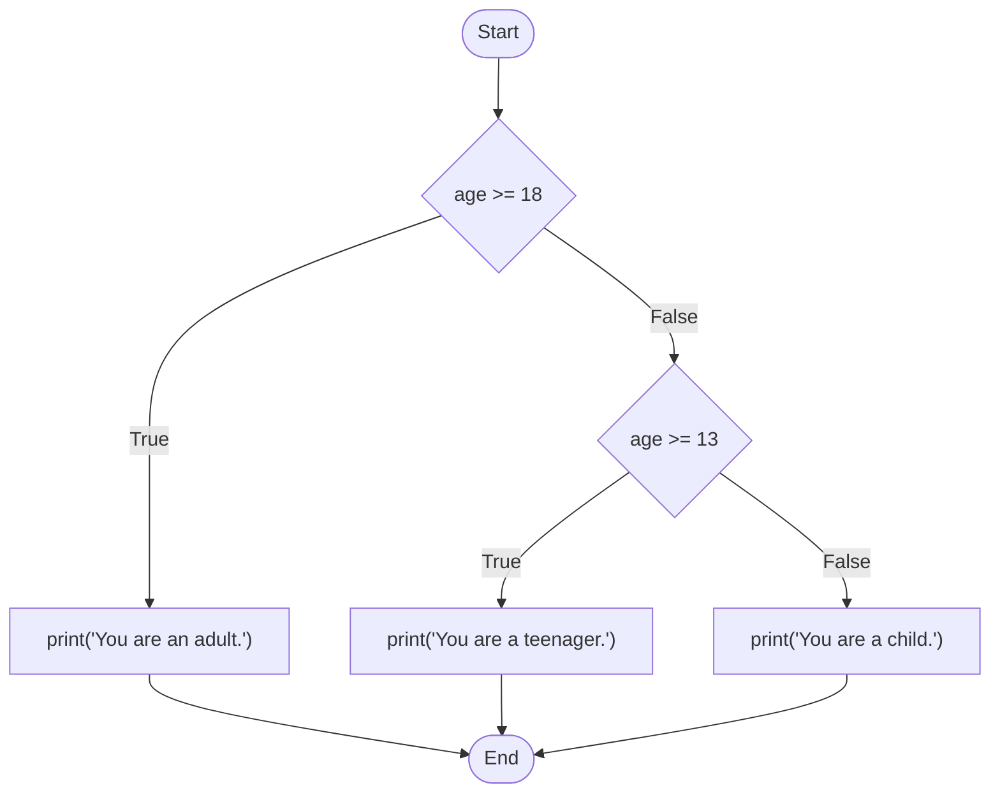

# M03 Conditional Logic

## The "Why?"

In the previous modules, our scripts ran sequentially from top to bottom, executing every single line.  
But in real-world applications, you rarely want everything to happen at once.  
Think about a login screen: you only want to grant access *if* the password is correct.  
Or consider an online store: you might want to apply a discount only *if* the cart total is over a certain amount.  
Conditional logic gives your program the ability to make decisions and create different paths (or branches) based on specific conditions.  
This transforms your scripts from simple linear calculators into dynamic, intelligent programs.

## Goals

Understand how to compare values, construct `if`, `elif`, and `else` statements, and control the flow of your Python scripts based on dynamic conditions.

## Core Concepts

### Comparison Operators

Before your program can make a decision, it needs to compare values.  
Comparisons in Python always result in a Boolean value: either `True` or `False`.  
Here are the most common comparison operators:

* Equal to: `==` (Note: a single `=` is used to assign values to variables, while a double `==` checks for equality)
* Not equal to: `!=`
* Greater than: `>`
* Less than: `<`
* Greater than or equal to: `>=`
* Less than or equal to: `<=`

```python
print(5 > 3)   # Output: True
print(10 == 5) # Output: False

```

### If, Elif, and Else

The `if` statement allows you to execute a block of code only when a specific condition is `True`.

You can use `elif` (else if) to check additional conditions, and `else` to provide a default action if none of the conditions are met.

Here is a flow chart illustrating how Python evaluates these conditions step by step:



**Important Note:** Python uses indentation (usually four spaces) to define code blocks. You must indent the code inside your conditional statements for the script to work properly.

```python
age = 20

if age >= 18:
    print("You are an adult.")
elif age >= 13:
    print("You are a teenager.")
else:
    print("You are a child.")

```

### Logical Operators

Sometimes you need to check multiple conditions at the same time. You can use logical operators (`and`, `or`, `not`) to combine them:

* `and`: Returns True if *both* statements are true.
* `or`: Returns True if *at least one* statement is true.
* `not`: Reverses the result (returns False if the result is true).

```python
score = 85
attendance = 90

if score >= 80 and attendance >= 80:
    print("You pass the course with honors!")

```

## Guided Practice

* Step 1: Create a simple condition
  Create a new file named `weather.py`.
  Create a variable `temperature` and assign it a number.
  Write an `if` statement to print "It's a hot day!" if the temperature is greater than 30.
  Run the script to see the result.
* Step 2: Add multiple conditions
  Update `weather.py` by adding an `elif` statement to print "It's a nice day." if the temperature is between 20 and 30.
  Add an `else` statement to print "It's cold!" for any other temperature.
  Change the `temperature` variable and run the script multiple times to test all three branches.
* Step 3: Combine with user input
  Modify the script to ask the user for the current temperature using the `input()` function.
  Remember to convert the input to a float or integer before comparing it.

## Checkpoints

* [ ] Write a grading script:
  Ask the user to input their test score (0-100).
  Print "Grade: A" if the score is 90 or above.
  Print "Grade: B" if the score is between 80 and 89.
  Print "Grade: C" if the score is between 70 and 79.
  Print "Grade: F" if the score is below 70.
* [ ] Upgrade the dynamic BMI calculator:
  Using the `dynamic_bmi.py` script you created in the previous module, add conditional logic to categorize the result.
  Print "Underweight" if BMI is less than 18.5.
  Print "Normal weight" if BMI is between 18.5 and 24.9.
  Print "Overweight" if BMI is 25 or higher.
