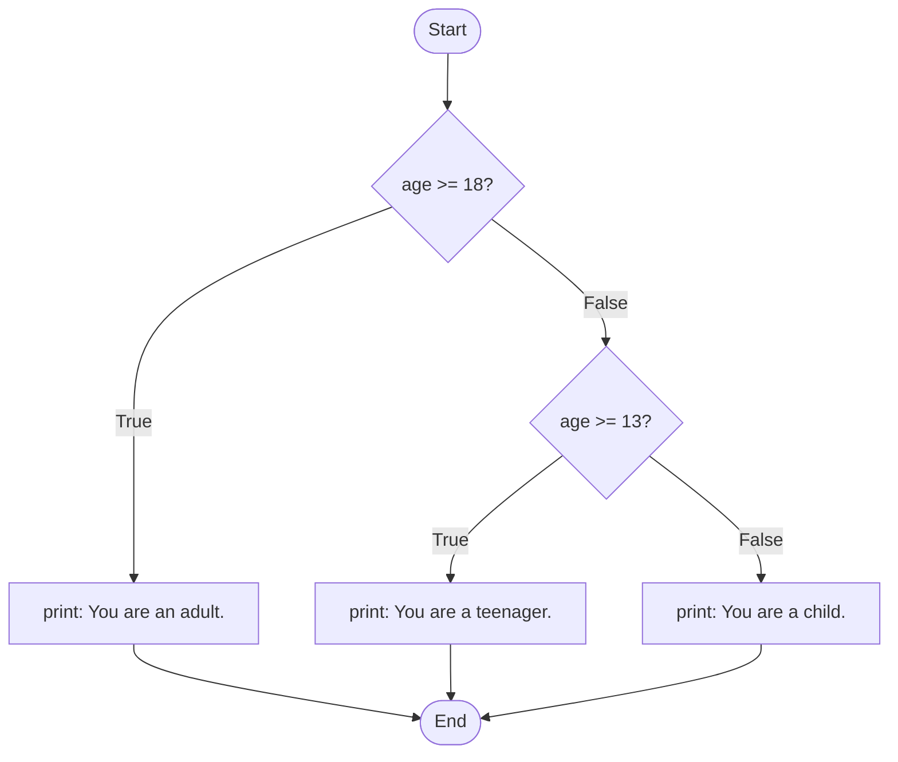

# M03 Conditional Logic


**Topics covered:** comparison operators 繚 `if` / `elif` / `else` 繚 logical operators (`and`, `or`, `not`) 繚 Boolean expressions 繚 nested conditions

## The Why?

In previous modules, our scripts ran every line from top to bottom without exception.
Real applications almost never do that.

A login screen only grants access *if* the password is correct.
A store only applies a discount *if* the cart total exceeds a threshold.
An alarm only fires *if* the temperature drops below freezing.

**Conditional logic** gives your program the ability to make decisions ??to follow different paths depending on the state of your data. Without it, a script can only ever do the same thing. With it, your scripts become genuinely intelligent.

---

## Core Concepts

### Comparison Operators

Before your program can make a decision, it needs to evaluate a condition.
A comparison in Python always produces a **Boolean** result: `True` or `False`.

| Operator | Meaning | Example | Result |
|----------|---------|---------|--------|
| `==` | Equal to | `5 == 5` | `True` |
| `!=` | Not equal to | `5 != 3` | `True` |
| `>` | Greater than | `10 > 7` | `True` |
| `<` | Less than | `3 < 1` | `False` |
| `>=` | Greater than or equal | `5 >= 5` | `True` |
| `<=` | Less than or equal | `4 <= 3` | `False` |

> **Important:** `=` assigns a value to a variable. `==` *compares* two values. Mixing these up is one of the most common beginner mistakes.

---

### `if`, `elif`, and `else`

```
Pseudocode:
if <condition>:
    do this
elif <another condition>:
    do this instead
else:
    do this if nothing above matched
```

Python uses **indentation** (4 spaces) to mark which code belongs inside a block. This is not optional ??inconsistent indentation causes errors.

```python
age = 20

if age >= 18:
    print("You are an adult.")
elif age >= 13:
    print("You are a teenager.")
else:
    print("You are a child.")
```


```mermaid
graph TD
    Start([Start]) --> A{"age >= 18?"}
    A -- True --> B["print: You are an adult."]
    A -- False --> C{"age >= 13?"}
    C -- True --> D["print: You are a teenager."]
    C -- False --> E["print: You are a child."]
    B --> End([End])
    D --> End
    E --> End
```

Python checks each condition **top to bottom** and runs only the first matching block. Once a match is found, the rest are skipped entirely.

---

### Logical Operators

Combine multiple conditions with `and`, `or`, and `not`:

| Operator | Returns `True` when??| Example |
|----------|---------------------|---------|
| `and` | **Both** conditions are true | `age >= 13 and age < 18` |
| `or` | **At least one** condition is true | `score >= 90 or bonus_points >= 5` |
| `not` | The condition is **false** | `not is_weekend` |

```python
score = 85
attendance = 90

if score >= 80 and attendance >= 80:
    print("You pass with honors!")
elif score >= 60 or attendance >= 90:
    print("You pass.")
else:
    print("You do not pass.")
```

---

### Checking String Values

Conditions work on strings too ??and string comparisons are **case-sensitive**:

```python
answer = input("Continue? (yes/no): ")

if answer.lower() == "yes":
    print("Continuing...")
else:
    print("Stopping.")
```

Calling `.lower()` before comparing avoids the case-sensitivity problem ??`"YES"`, `"Yes"`, and `"yes"` all become `"yes"`.

---

## Going Further

<details>
<summary>Ternary (One-Line) Conditional</summary>

For simple two-outcome decisions, Python has a compact syntax:

```python
label = "Pass" if score >= 60 else "Fail"
```

This is equivalent to:
```python
if score >= 60:
    label = "Pass"
else:
    label = "Fail"
```

Use it when the logic is simple enough to read in one line ??avoid it when the condition is complex.

</details>

<details>
<summary>Chained Comparisons</summary>

Python lets you chain comparisons naturally, like math notation:

```python
# Standard
if 18 <= age and age < 65:

# Chained ??reads exactly like math
if 18 <= age < 65:
```

Both are equivalent, but chained comparisons are more Pythonic.

</details>

<details>
<summary>Truthy and Falsy Values</summary>

In Python, many non-Boolean values are treated as `True` or `False` in a condition:

| Falsy (treated as `False`) | Truthy (treated as `True`) |
|---------------------------|---------------------------|
| `0`, `0.0` | Any non-zero number |
| `""` (empty string) | Any non-empty string |
| `None` | Any object |
| `[]`, `{}`, `()` (empty collections) | Non-empty collections |

```python
name = input("Enter your name: ")
if name:             # True if name is not empty
    print(f"Hello, {name}!")
else:
    print("No name entered.")
```

</details>

<details>
<summary>`match` / `case` (Python 3.10+)</summary>

For switching on a specific value with many branches, the newer `match` statement is cleaner:

```python
command = input("Enter command: ").lower()

match command:
    case "start":
        print("Starting...")
    case "stop":
        print("Stopping.")
    case "status":
        print("Running.")
    case _:
        print("Unknown command.")
```

</details>

<details>
<summary>AI Prompting for Conditional Logic</summary>

Describe the business rules clearly:
- ??"Add some conditions to my script"
- ??"Add conditions: if score ??90 ??Grade A, 80??9 ??B, 70??9 ??C, below 70 ??F. Use elif so only one branch runs."

</details>

---

## Guided Practice

We will build a **weather advisor** ??a script that recommends what to wear based on the temperature the user inputs.

### Step 1 ??Create the file and collect input

Create `weather_example.py`. Ask the user for the current temperature and convert it to a float:

```python
temp_str = input("Enter the current temperature (簞C): ")
temperature = float(temp_str)
```

### Step 2 ??Add basic conditions

Add `if / elif / else` to cover three temperature ranges:

```python
if temperature > 30:
    print("It's hot! Wear light clothing and stay hydrated.")
elif temperature >= 20:
    print("It's a nice day. A t-shirt should be fine.")
elif temperature >= 10:
    print("It's cool. Bring a light jacket.")
else:
    print("It's cold! Wear a coat and scarf.")
```

Run the script and test it with `35`, `25`, `15`, and `5`.

### Step 3 ??Add a logical condition

Add a check for rain. Ask the user whether it is raining:

```python
rain_input = input("Is it raining? (yes/no): ")
is_raining = rain_input.lower() == "yes"
```

Now extend the logic to combine temperature and rain:

```python
if temperature > 30 and is_raining:
    print("Hot and raining ??light clothes and an umbrella!")
elif temperature > 30:
    print("Hot and sunny ??sunscreen recommended.")
elif temperature >= 20 and not is_raining:
    print("Perfect weather for a walk.")
elif is_raining:
    print("Take an umbrella regardless of temperature.")
else:
    print("Bundle up!")
```

Test all combinations: hot+rain, hot+no-rain, mild+rain, cold+no-rain.

---

## Checkpoints

* [ ] **Grading System**
  Ask the user for a test score (0??00).
  Print the letter grade: A (??0), B (80??9), C (70??9), D (60??9), F (<60).
  Also print whether the student passed (grade is D or above) or failed.
  *(Bonus: what should happen if the user enters 105 or -3? Add a validation check.)*

* [ ] **Smart BMI Advisor**
  Extend the BMI calculator from M02.
  After calculating BMI, use conditional logic to print:
  - Underweight (<18.5) ??"Consider consulting a nutritionist."
  - Normal (18.5??4.9) ??"Great! Your BMI is in the healthy range."
  - Overweight (25??9.9) ??"Consider increasing physical activity."
  - Obese (??0) ??"Please consult a healthcare professional."

* [ ] **ATM Transaction Simulator**
  Set an account balance and a daily withdrawal limit (e.g., `balance = 5000`, `limit = 10000`).
  Ask the user for the amount they want to withdraw.
  Validate and print a result:
  - Amount must be a positive number
  - Cannot exceed the account balance
  - Cannot exceed the daily withdrawal limit
  - If all checks pass: print "Transaction approved. New balance: 瞼X"
  *(Hint: use `and` to combine multiple conditions in a single `if` statement.)*
