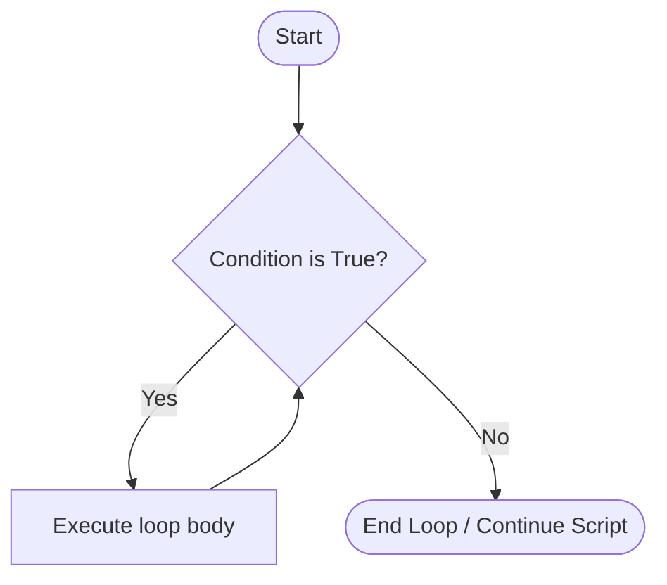

# M04 Iteration

## The "Why?"

Humans generally dislike doing the exact same tedious task over and over again. Computers, on the other hand, excel at it.  
Imagine you need to rename 1,000 image files, send customized emails to 500 subscribers, or process thousands of rows in a dataset. Writing out the code for each individual item would take forever and defeat the purpose of programming.  
Iteration (commonly known as "loops") allows you to write a block of code once and have the computer repeat it as many times as needed.  
This is the core mechanic that unlocks the true scale and automation power of Python.

## Goals

Understand how to repeat actions using `for` and `while` loops, iterate over sequences of data, and control when a loop should stop.

## Core Concepts

### The `for` Loop and `range()`

A `for` loop is used when you know *exactly how many times* you want to repeat a task, or when you want to go through a specific sequence of items one by one.

The `range()` function is often used with `for` loops to generate a sequence of numbers. By default, `range(5)` generates numbers from 0 up to (but not including) 5.

```python
# This will print 0, 1, 2, 3, 4
for i in range(5):
    print(f"Iteration number: {i}")

```

### Iterating Over Collections (Lists)

In Python, a "List" is a way to store multiple items in a single variable. You write a list using square brackets `[]`.

A `for` loop makes it incredibly easy to process every item in a list.

```python
fruits = ["apple", "banana", "cherry"]

for fruit in fruits:
    print(f"I love eating {fruit}s!")

```

### The `while` Loop

A `while` loop is used when you want to repeat a task *until a certain condition changes*. It works similarly to an `if` statement, but instead of executing the code block just once, it keeps repeating it as long as the condition remains `True`.

Here is a flow chart illustrating how a `while` loop evaluates its condition before every single repetition:



**Warning:** If the condition never becomes `False`, the loop will run forever! This is called an "infinite loop." Always make sure something inside the loop will eventually change the condition.

```python
countdown = 3

while countdown > 0:
    print(countdown)
    countdown = countdown - 1  # Decrease the value so the loop will eventually stop

print("Go!")

```

## Guided Practice

* Step 1: Count with a `for` loop
  Create a file named `loops.py`.
  Use a `for` loop and `range(1, 6)` to print the numbers 1 through 5.
  *(Note: `range(start, stop)` starts at the first number and stops right before the second number).*
* Step 2: Iterate over a list
  In the same file, create a list of three of your favorite movies.
  Write a `for` loop to print a sentence about each movie, like "One of my favorite movies is [Movie Name]."
* Step 3: Create a `while` loop for user input
  Create a new file named `password_check.py`.
  Create a variable `password = ""`.
  Write a `while` loop that checks if `password != "secret"`.
  Inside the loop, use `input()` to ask the user to "Enter the password: " and assign it to the `password` variable.
  Outside the loop (unindented), print "Access Granted!".
  Run the script. Notice how it traps you until you type the correct word.

## Checkpoints

* [ ] Write a Multiplication Table generator:
  Ask the user to input a number (e.g., 7).
  Use a `for` loop to print the multiplication table for that number from 1 to 10.
  Output example:
  `7 x 1 = 7`
  `7 x 2 = 14`
  `...`
* [ ] Build a "Guess the Number" game:
  Set a secret number in a variable (e.g., `secret = 42`).
  Use a `while` loop to continuously ask the user to guess the number.
  Combine this with conditional logic (`if/elif/else`) from M03:
  - If the guess is too high, print "Too high, try again."
  - If the guess is too low, print "Too low, try again."
  - If they guess correctly, print "You got it!" and let the loop end.
