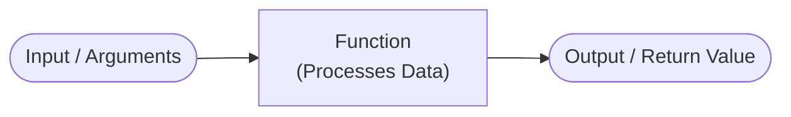

# M05 Functions

## The "Why?"

As your scripts grow larger and more complex, you will quickly find yourself writing or copying the exact same blocks of code over and over again. 
Not only does this make your program extremely long and difficult to read, but it also creates a maintenance nightmare. If you need to fix a bug or update a formula (like the BMI calculation from previous modules), you would have to find and change it in every single place you pasted it.

Functions solve this problem by allowing you to package a specific block of code, give it a name, and reuse it anywhere in your script. 
By wrapping code into functions, you instantly improve the aesthetics of your code (making it cleaner and easier to read) and dramatically reduce redundant repetition. This follows one of the golden rules of software development: **DRY (Don't Repeat Yourself)**.

## Goals

Understand how to define custom functions, pass data into them using parameters, retrieve results using return values, and organize your code into modular, reusable blocks.

## Core Concepts

### Defining and Calling a Function

In Python, you create (or "define") a function using the `def` keyword, followed by the function name and parentheses `()`. 
Just like `if` statements and loops, the code block inside the function must be indented.

Defining a function doesn't run the code inside it immediately; it simply saves it for later. To actually execute the code, you must "call" the function by writing its name followed by parentheses.

```python
# Defining the function
def say_hello():
    print("Hello! Welcome to the application.")

# Calling the function
say_hello()
say_hello() # You can call it as many times as you need!
```

### Parameters and Arguments

Functions become significantly more powerful when you can pass data into them to change how they behave dynamically. You do this by defining "parameters" inside the parentheses. 
When you call the function, the actual values you pass in are called "arguments".

```python
def greet_user(name):
    print(f"Hello, {name}!")

greet_user("Alice")
greet_user("Bob")
```

### Return Values

Often, you don't just want a function to print something to the screen; you want it to perform a calculation and hand the result back to your main script so you can use it for something else.
You achieve this using the `return` keyword. Once a function hits a `return` statement, it immediately stops executing and sends the value back.

Here is a conceptual flow of how data moves through a function:



```python
def calculate_total(price, tax_rate):
    total = price + (price * tax_rate)
    return total

# The returned value is saved into the variable 'final_price'
final_price = calculate_total(100, 0.05)
print(f"You owe: ${final_price}")
```

## Guided Practice

* Step 1: Define the function and parameters  
  Let's create a function called `calculate_parking_fee` that requires one piece of information to work: the number of hours a car was parked. We will set this up using the `def` keyword and add `hours` as our parameter.
  ```python
  def calculate_parking_fee(hours):
      # We will add our pricing logic here
      pass
  ```

* Step 2: Implement the pricing logic  
  Now, replace `pass` with our calculation. Let's assume the parking lot charges a flat rate of $5 for the first two hours, and $3 for every extra hour. We can use an `if/else` statement to calculate the `total_fee` based on the `hours` provided.
  ```python
  def calculate_parking_fee(hours):
      if hours <= 2:
          total_fee = 5
      else:
          extra_hours = hours - 2
          total_fee = 5 + (extra_hours * 3)

      return total_fee
  ```

* Step 3: Call the function inside a loop
  Instead of testing the function with only one fixed value, let's keep asking the user for the number of hours parked. We will use a `while` loop to repeatedly wait for input, calculate the fee, and display the result.
  ```python
  while True:
      user_input = input("Enter parking hours (or type 'q' to quit): ")

      if user_input.lower() == 'q':
          break

      hours = int(user_input)
      customer_fee = calculate_parking_fee(hours)

      print(f"You parked for {hours} hours.")
      print(f"Your total parking fee is: ${customer_fee}")
      print()
  ```

## Checkpoints

* [ ] Refactor the Grading Script:
  Take the grading logic you wrote in the M03 checkpoint and wrap it inside a function called `get_grade(score)`.
  Instead of printing the grade directly inside the function, use `return` to send back the grade string (e.g., "A", "B").
  Ask the user for their score using `input()`, pass it into the function, and print the returned result.
* [ ] Build a Shopping Cart Calculator:
  Write a function called `sum_cart(cart_items)` that takes a List of numbers as a parameter.
  Inside the function, use a `for` loop (from M04) to add up all the numbers into a running total.
  `return` the final total.
  Test it outside the function by passing a list like `prices = [15.99, 5.00, 2.50]` and printing the result.
