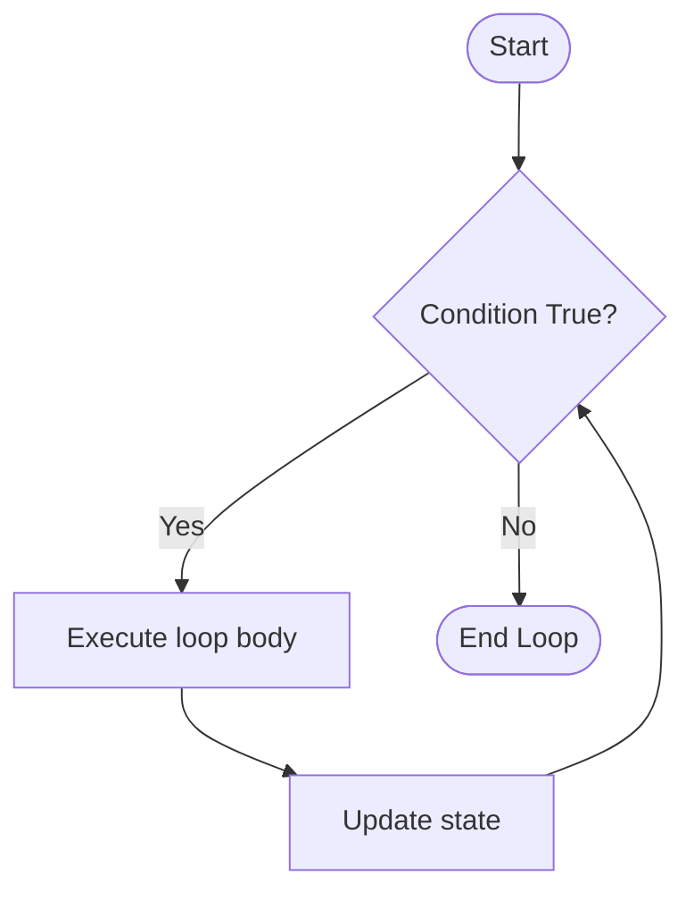

# M05 Iteration


**Topics covered:** `for` loop · `while` loop · `range()` · `enumerate()` · iterating over lists and dicts · `break` · `continue`

## The Why?

Humans dislike doing the same thing a thousand times. Computers don't.

Imagine renaming 1,000 image files, sending customized emails to 500 subscribers, or calculating statistics for every row in a 50,000-row spreadsheet. Writing out the code for each individual item would take forever —and it would break the moment the data changes.

**Iteration** (loops) lets you write a block of code *once* and have the computer repeat it as many times as needed. Combined with the data structures from M04 (lists, dicts, sets), loops unlock the true power of automation: processing large collections effortlessly.

---

## Core Concepts

### The `for` Loop —When You Know What to Iterate Over

A `for` loop walks through a sequence item by item.

```
Pseudocode:
for each <item> in <collection>:
    do something with <item>
```

**Iterating over a list:**

```python
fruits = ["apple", "banana", "cherry"]

for fruit in fruits:
    print(f"I like {fruit}s!")
```

**Iterating over a dict** —`for` loops over keys by default:

```python
student = {"name": "Alice", "gpa": 3.8, "major": "CS"}

for key in student:
    print(f"{key}: {student[key]}")

# Or iterate over both key and value together:
for key, value in student.items():
    print(f"{key} —{value}")
```

---

### `range()` —Generating Number Sequences

`range(n)` generates the integers from `0` up to (but **not including**) `n`.

```python
for i in range(5):
    print(i)   # 0, 1, 2, 3, 4
```

`range(start, stop, step)`:

```python
for i in range(2, 10, 2):
    print(i)   # 2, 4, 6, 8
```

---

### `enumerate()` —Loop With an Index

When you need both the index and the value:

```python
menu = ["coffee", "tea", "juice"]

for index, item in enumerate(menu, start=1):
    print(f"{index}. {item}")
```

Output:
```
1. coffee
2. tea
3. juice
```

---

### The `while` Loop —Repeat Until a Condition Changes

A `while` loop keeps running as long as a condition is `True`.
It is the right choice when you do not know in advance how many times to repeat.

```
Pseudocode:
while <condition is True>:
    do something
    (update something so the condition eventually becomes False)
```



```python
countdown = 5
while countdown > 0:
    print(countdown)
    countdown -= 1   # countdown = countdown - 1
print("Go!")
```

> **Warning:** If the condition never becomes `False`, the loop runs forever —called an **infinite loop**. Always make sure something inside the loop moves toward the exit condition.

---

### `break` and `continue`

`break` exits the loop immediately:

```python
for number in range(10):
    if number == 5:
        break       # Stop at 5
    print(number)   # Prints 0, 1, 2, 3, 4
```

`continue` skips the rest of the current iteration and moves to the next one:

```python
for number in range(10):
    if number % 2 == 0:
        continue    # Skip even numbers
    print(number)   # Prints 1, 3, 5, 7, 9
```

---

## Going Further

<details>
<summary>`zip()` —Pair Up Two Lists</summary>

```python
names  = ["Alice", "Bob", "Carol"]
scores = [92,      85,    78     ]

for name, score in zip(names, scores):
    print(f"{name}: {score}")
```

</details>

<details>
<summary>Nested Loops</summary>

A loop inside a loop —classic for processing 2D grids or generating combinations:

```python
for row in range(3):
    for col in range(3):
        print(f"({row},{col})", end=" ")
    print()
```

</details>

<details>
<summary>List Comprehensions</summary>

A compact `for` loop that builds a new list in one line:

```python
squares = [x ** 2 for x in range(1, 6)]
# [1, 4, 9, 16, 25]

passing = [s for s in scores if s >= 60]
# Only the scores that passed
```

AI generates these constantly. Learn to read them before using them.

</details>

<details>
<summary>Dict Comprehensions</summary>

```python
grade_map = {name: score for name, score in zip(names, scores)}
# {'Alice': 92, 'Bob': 85, 'Carol': 78}
```

</details>

<details>
<summary>Performance Tip</summary>

Never modify a list while iterating over it directly —use a copy (`my_list[:]`) or build a new list with a comprehension.

</details>

---

## Guided Practice

**Scenario:** You just finished grading a class of students by hand. Instead of reaching for a spreadsheet, you want a terminal script that collects every score, then instantly prints the pass rate, class average, and a ranked list from highest to lowest. We will build an **exam statistics calculator** that does exactly that.

### Step 1 —Collect scores with a `while` loop

Create `exam_stats_example.py`. Keep asking the user for scores until they enter something non-numeric:

```python
scores = []

print("Enter exam scores one at a time.")
print("Type anything non-numeric when done.\n")

while True:
    user_input = input("Score: ")

    if user_input.isnumeric():
        scores.append(int(user_input))
    else:
        print("Input ended.")
        break
```

Run the script and enter a few numbers, then type "done" to stop.

### Step 2 —Count passing and failing scores

Add a `for` loop to process each score:

```python
pass_count = 0
fail_count = 0

for score in scores:
    if score >= 60:
        pass_count += 1
    else:
        fail_count += 1
```

### Step 3 —Calculate and print statistics

```python
total = len(scores)

if total == 0:
    print("No scores entered.")
else:
    pass_rate = pass_count / total * 100
    average   = sum(scores) / total

    print(f"\n=== Exam Statistics ===")
    print(f"Total:    {total}")
    print(f"Passed:   {pass_count}  ({pass_rate:.1f}%)")
    print(f"Failed:   {fail_count}")
    print(f"Average:  {average:.1f}")
    print(f"Highest:  {max(scores)}")
    print(f"Lowest:   {min(scores)}")
```

### Step 4 —Print a ranked score list

Use `enumerate()` to print each score with its position (highest first):

```python
print("\n=== Individual Scores ===")
for rank, score in enumerate(sorted(scores, reverse=True), start=1):
    status = "PASS" if score >= 60 else "FAIL"
    print(f"  {rank}. {score:>3}  [{status}]")
```

---

## Checkpoints

* [ ] **Guess the Number**
  Use `random.randint(1, 100)` to pick a secret number.
  Use a `while` loop to keep asking for guesses.
  After each guess, print "Too high", "Too low", or "Correct! You got it in X guesses."
  Count how many guesses the user needed.

* [ ] **Shopping Cart Total**
  Create a list of dicts, each with a `product` name and `price`.
  Use `enumerate` to print each item with its index number (1-based).
  Calculate and print the subtotal, a 5% tax, and the total.
  *(Bonus: use the loop to find and print the most expensive item.)*

* [ ] **Multiplication Table Generator**
  Ask the user for a number `n` (1–12).
  Print the complete multiplication table for `n`, formatted neatly:
  ```
  5 ×  1 =  5
  5 ×  2 = 10
  ...
  5 × 12 = 60
  ```

* [ ] **Password Strength Checker**
  Ask the user to enter a password.
  Use a `for` loop to check each character.
  Count: uppercase letters, lowercase letters, digits, and special characters.
  Rate the password: Weak (one character type), Medium (two), Strong (three or more).
