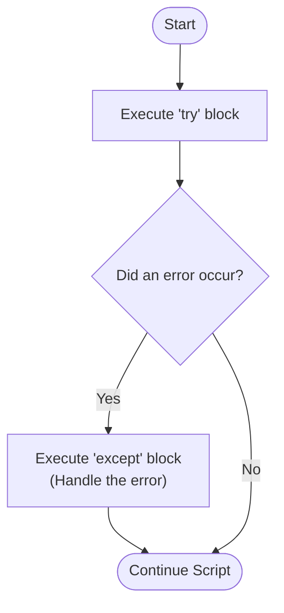

# M06 Error Handling

## The "Why?"

In a perfect world, your code would run exactly as intended every single time. However, in the real world, things go wrong. Users might type letters when you specifically asked for a number, a required file might be missing, or a network connection might drop. 

Without error handling, these unexpected events cause your Python script to crash abruptly, stopping the program entirely and spitting out intimidating red error messages (called a "traceback"). Error handling allows you to anticipate these points of failure. Instead of letting the program crash, you can "catch" the error, handle it gracefully, and provide a helpful message to the user or allow the script to safely continue running. This is the key to building reliable and user-friendly applications.

## Goals

Understand how to anticipate program crashes, use `try` and `except` blocks to handle exceptions gracefully, catch specific error types, and build robust Python scripts that don't break on bad inputs.

## Core Concepts

### Exceptions

When Python encounters an error during execution, it raises an "Exception". For example, trying to divide a number by zero raises a `ZeroDivisionError`. Trying to convert the word "apple" into an integer raises a `ValueError`. If these exceptions are not handled, the program stops immediately.

### The `try` and `except` Block

The primary tool for handling errors in Python is the `try` and `except` block. You put the risky code that might cause an error inside the `try` block. If an error occurs, Python stops executing the `try` block and immediately jumps to the `except` block. 



```python
try:
    # Risky code that might fail
    user_input = input("Enter your age: ")
    age = int(user_input)
    print(f"You will be {age + 1} next year.")
except:
    # This runs if ANYTHING goes wrong in the try block
    print("Error: Please enter a valid whole number!")
```

### Catching Specific Exceptions

While a bare `except` catches everything, it is a best practice to catch *specific* errors. This allows you to respond differently depending on what exactly went wrong. You can chain multiple `except` blocks together.

```python
try:
    result = 10 / 0
except ZeroDivisionError:
    print("You cannot divide a number by zero.")
except ValueError:
    print("Invalid value provided.")
```

## Guided Practice

* Step 1: Write the fragile code
  Create a file named `divider.py`. Let's write a simple script that asks the user for a number and divides 100 by it.
  ```python
  divisor = input("Enter a number to divide 100 by: ")
  number = int(divisor)
  result = 100 / number
  print(f"The result is {result}")
  ```
  *(Run this script and type "hello" or "0". Watch how the program crashes and prints a traceback).*

* Step 2: Wrap the code in a `try` block
  Identify the code that might fail (the conversion to integer and the division) and indent it under a `try` statement.
  ```python
  divisor = input("Enter a number to divide 100 by: ")
  
  try:
      number = int(divisor)
      result = 100 / number
      print(f"The result is {result}")
  ```

* Step 3: Handle the `ValueError`
  If the user types a word instead of a number, `int(divisor)` will trigger a `ValueError`. Let's catch it.
  ```python
  divisor = input("Enter a number to divide 100 by: ")
  
  try:
      number = int(divisor)
      result = 100 / number
      print(f"The result is {result}")
  except ValueError:
      print("That is not a number! Please enter digits only.")
  ```

* Step 4: Handle the `ZeroDivisionError`
  If the user types "0", the math operation will fail. Add another `except` block to handle this specific scenario gracefully.
  ```python
  divisor = input("Enter a number to divide 100 by: ")
  
  try:
      number = int(divisor)
      result = 100 / number
      print(f"The result is {result}")
  except ValueError:
      print("That is not a number! Please enter digits only.")
  except ZeroDivisionError:
      print("Math error: You cannot divide by zero!")
  ```

## Checkpoints

* [ ] Build an "Unbreakable" Input Prompt:
  Combine a `while` loop (from M04) with a `try/except` block.
  Continuously ask the user to input their birth year.
  If they enter invalid text (causing a `ValueError`), print a warning and let the loop ask them again.
  If they enter a valid integer, print the year, use the `break` keyword to exit the loop, and end the script.
* [ ] Safe List Access:
  Create a list of 4 items (e.g., `colors = ["red", "blue", "green", "yellow"]`).
  Ask the user to enter a number between 1 and 4 to pick a color.
  Subtract 1 from their input to get the correct list index.
  Use `try` and `except` to handle both `ValueError` (if they type letters) and `IndexError` (if they type a number like 99 that doesn't exist in the list).
  Print the selected color if successful.
