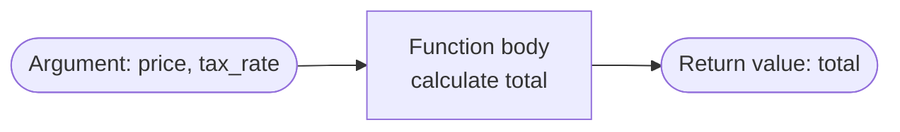

# M06 Functions


**Topics covered:** `def` 繚 parameters 繚 return values 繚 default arguments 繚 variable scope 繚 DRY principle

## The Why?

As your scripts grow, you will find yourself copy-pasting the same logic in multiple places.
This creates a hidden trap: when you need to fix a bug or update a formula, you must find and change it everywhere it was pasted. Miss one, and you have a silent inconsistency.

**Functions** solve this by letting you package a block of code, give it a name, and reuse it anywhere.
This principle has a name in software development: **DRY ??Don't Repeat Yourself**.

Functions also improve readability. A script that calls `calculate_total()`, `apply_discount()`, and `format_receipt()` is far easier to understand than one with all that logic inlined. AI assistants structure code this way by default ??being able to read and modify function-based code is essential.

---

## Core Concepts

### Defining and Calling a Function

```
Pseudocode:
def function_name(parameter1, parameter2):
    do something with parameters
    return result
```

Define a function once with `def`. Call it as many times as you need:

```python
def say_hello():
    print("Hello! Welcome.")

say_hello()   # Call it
say_hello()   # Call it again ??same code, no duplication
```

**Important:** defining a function does *not* run its code. The code only runs when you *call* the function.

---

### Parameters and Arguments

**Parameters** are the placeholders defined in the function signature.
**Arguments** are the actual values you pass when calling the function.

```python
def greet(name):           # 'name' is a parameter
    print(f"Hello, {name}!")

greet("Alice")             # 'Alice' is an argument
greet("Bob")               # 'Bob' is an argument
```

A function can have multiple parameters:

```python
def calculate_area(width, height):
    return width * height

area = calculate_area(10, 5)   # area = 50
```

---

### Return Values

`return` sends a value back to the caller. Without `return`, a function returns `None`.



```python
def calculate_total(price, tax_rate):
    total = price * (1 + tax_rate)
    return total

final_price = calculate_total(100, 0.05)
print(f"You owe: ${final_price:.2f}")   # You owe: $105.00
```

Once Python hits `return`, the function **immediately stops** ??any code after it is not executed.

---

### Default Arguments

You can give a parameter a default value so it becomes optional:

```python
def greet(name, greeting="Hello"):
    print(f"{greeting}, {name}!")

greet("Alice")              # Hello, Alice!
greet("Bob", "Good morning") # Good morning, Bob!
```

Parameters with defaults must come *after* parameters without defaults.

---

### Variable Scope

Variables created inside a function are **local** ??they do not exist outside:

```python
def my_function():
    x = 10          # local variable
    print(x)

my_function()
print(x)            # ??NameError: name 'x' is not defined
```

Variables created outside a function are **global** and are readable (but not assignable) inside:

```python
TAX_RATE = 0.05    # global constant

def calculate_tax(price):
    return price * TAX_RATE   # reads global constant ??OK
```

A good rule of thumb: pass data *in* through parameters and pass data *out* through `return`. Avoid modifying globals from inside functions.

---

## Going Further

<details>
<summary>`*args` ??Accept Any Number of Positional Arguments</summary>

```python
def sum_all(*numbers):
    return sum(numbers)

print(sum_all(1, 2, 3, 4))   # 10
```

</details>

<details>
<summary>`**kwargs` ??Accept Any Number of Keyword Arguments</summary>

```python
def create_profile(**info):
    for key, value in info.items():
        print(f"{key}: {value}")

create_profile(name="Alice", age=25, role="admin")
```

</details>

<details>
<summary>Type Hints (Python 3.5+)</summary>

Type hints are annotations that document what types a function expects and returns. They are not enforced at runtime but help IDEs and humans understand the code:

```python
def calculate_bmi(weight: float, height: float) -> float:
    return weight / height / height
```

AI-generated code often includes type hints. They are harmless to leave in and good practice to adopt.

</details>

<details>
<summary>Docstrings</summary>

A string immediately after the `def` line documents what the function does:

```python
def calculate_parking_fee(hours: float, daily_max: float = 30) -> float:
    """Calculate parking fee with tiered pricing and a daily cap."""
    ...
```

</details>

<details>
<summary>Lambda Functions</summary>

A lambda is a tiny anonymous function written in one line ??useful for short transformations:

```python
double = lambda x: x * 2
print(double(5))   # 10

# Common use: sort a list of dicts by a key
contacts.sort(key=lambda c: c["name"])
```

</details>

---

## Guided Practice

We will build a **parking fee calculator** with a tiered pricing model, demonstrating parameters, return values, and reuse.

### Step 1 ??Define the function

Create `parking_example.py`. Define a function that accepts the number of hours parked:

```python
def calculate_parking_fee(hours):
    pass  # we will fill this in next
```

### Step 2 ??Implement the pricing logic

Replace `pass` with the calculation. The lot charges $5 for the first 2 hours, then $3 per additional hour:

```python
def calculate_parking_fee(hours):
    if hours <= 2:
        total_fee = 5
    else:
        extra_hours = hours - 2
        total_fee = 5 + (extra_hours * 3)
    return total_fee
```

Test it manually by calling it with a few values:

```python
print(calculate_parking_fee(1))    # 5
print(calculate_parking_fee(2))    # 5
print(calculate_parking_fee(5))    # 14
```

### Step 3 ??Build an interactive loop

Wrap the function in a `while True` loop to simulate a ticketing kiosk. Accept `q` to quit:

```python
while True:
    user_input = input("\nEnter parking hours (or 'q' to quit): ")

    if user_input.lower() == "q":
        print("Goodbye!")
        break

    try:
        hours = float(user_input)
        fee   = calculate_parking_fee(hours)
        print(f"Hours parked: {hours:.1f}")
        print(f"Total fee:    ${fee:.2f}")
    except ValueError:
        print("Please enter a valid number.")
```

### Step 4 ??Add a daily maximum

Extend the function with a default parameter for a daily maximum fee:

```python
def calculate_parking_fee(hours, daily_max=30):
    if hours <= 2:
        total_fee = 5
    else:
        extra_hours = hours - 2
        total_fee = 5 + (extra_hours * 3)
    return min(total_fee, daily_max)   # Never exceed the daily max
```

Test: `calculate_parking_fee(20)` should return `30`, not `59`.

---

## Checkpoints

* [ ] **Refactor the Grading Script**
  Take the grading logic from M03's checkpoint and wrap it inside a function `get_grade(score)`.
  The function should `return` the grade string ("A", "B", "C", "D", "F") rather than printing it.
  Call it from outside, then print the result. Add a default parameter so scores below 0 return "Invalid".

* [ ] **Shopping Cart Calculator**
  Write a function `calculate_cart(items)` that takes a list of dicts (`[{"name": "...", "price": X, "qty": Y}]`).
  Inside the function, use a `for` loop to calculate the total.
  Return a dict with `subtotal`, `tax` (10%), and `total`.
  Test it with at least three items and print a formatted receipt.

* [ ] **Temperature Converter**
  Write three functions: `celsius_to_fahrenheit(c)`, `fahrenheit_to_celsius(f)`, and `celsius_to_kelvin(c)`.
  Then build a menu-driven script: show the user three conversion options, ask for input, call the matching function, and print the result.
  The script should loop until the user enters `q` to quit.
