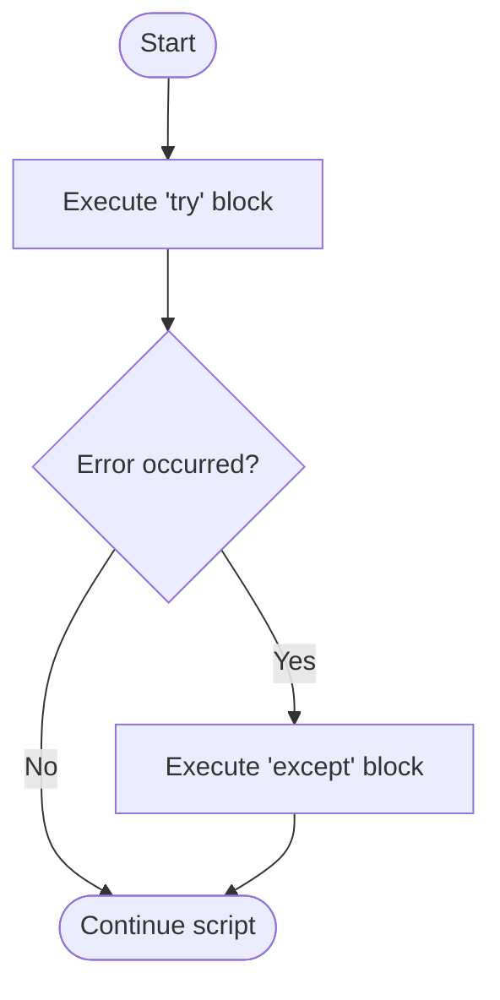

# M08 Error Handling


**Topics covered:** exceptions · `try` / `except` / `finally` · catching specific error types · `raise` · defensive input validation

## The Why?

In a perfect world, your code would run exactly as intended every single time.
In the real world, things go wrong: users type letters when you ask for a number, a required file is missing, a network connection drops mid-request, a divide-by-zero slips through.

Without error handling, these events cause Python to **crash** — it prints a red "traceback" and stops the program entirely. That is fine during development, but unacceptable in any script you hand to another person or schedule to run unattended overnight.

**Error handling** lets you anticipate points of failure, catch the error before it crashes everything, show a useful message, and allow the program to continue (or exit cleanly). It is what separates a script that *technically works* from one that is genuinely reliable.

---

## Core Concepts

### What Is an Exception?

When Python encounters an error during execution, it **raises an exception** — a signal that something went wrong.
If nothing catches the exception, the program halts and prints a traceback.

Common exceptions you will see:

| Exception | When it occurs |
|-----------|----------------|
| `ValueError` | Wrong type of value (e.g., `int("abc")`) |
| `TypeError` | Wrong type for an operation (e.g., `"a" + 1`) |
| `ZeroDivisionError` | Division by zero (`10 / 0`) |
| `FileNotFoundError` | Opening a file that does not exist |
| `IndexError` | Accessing a list index out of range (`my_list[99]`) |
| `KeyError` | Accessing a dict key that does not exist (`d["missing"]`) |

---

### `try` / `except` — Catch and Handle Errors

```
Pseudocode:
try:
    risky code that might fail
except SomeError:
    what to do if that specific error occurs
```



```python
try:
    age = int(input("Enter your age: "))
    print(f"Next year you will be {age + 1}.")
except ValueError:
    print("Error: Please enter a whole number.")
```

If the user types `"twenty"`, `int()` raises a `ValueError`, the `except` block runs instead of crashing, and the program continues.

---

### Catching Multiple Specific Exceptions

Always catch the **most specific** exception you can. Catching bare `except:` hides bugs.

```python
total_cost = 500.00

try:
    qty = int(input("Quantity received: "))
    unit_price = total_cost / qty
    print(f"Unit price: ${unit_price:.2f}")
except ValueError:
    print("Error: Quantity must be a whole number.")
except ZeroDivisionError:
    print("Error: Quantity cannot be zero.")
```

Python checks `except` clauses top to bottom and runs only the first match.

---

### The `finally` Block — Always Runs

Code in `finally` runs regardless of whether an error occurred.
Use it to close files, disconnect from databases, or release any resource:

```python
try:
    result = 10 / int(input("Divisor: "))
    print(result)
except ZeroDivisionError:
    print("Cannot divide by zero.")
finally:
    print("Calculation attempt complete.")   # Always printed
```

---

### `else` with `try` — Runs Only on Success

The optional `else` block runs only when NO exception was raised:

```python
try:
    value = int(input("Enter a number: "))
except ValueError:
    print("That is not a number.")
else:
    print(f"Double that is {value * 2}.")   # Only runs if no error
```

---

## Going Further

<details>
<summary>Creating Custom Exceptions</summary>

For larger projects, define your own exception types by subclassing `Exception`:

```python
class InvalidAgeError(Exception):
    pass

def verify_age(age):
    if age < 0 or age > 150:
        raise InvalidAgeError(f"Age {age} is not plausible.")
    return age

try:
    verify_age(200)
except InvalidAgeError as e:
    print(f"Validation failed: {e}")
```

This makes error messages more meaningful and allows callers to catch your error specifically.

</details>

<details>
<summary>The `logging` Module</summary>

Instead of `print()` for error messages, use the `logging` module in production code:

```python
import logging
logging.basicConfig(level=logging.ERROR)

try:
    result = 10 / 0
except ZeroDivisionError:
    logging.error("Division by zero encountered.")
```

Logging lets you control which messages are shown (DEBUG, INFO, WARNING, ERROR, CRITICAL) and write them to files.

</details>

<details>
<summary>Exception Chaining (`raise ... from ...`)</summary>

When you catch one exception and raise another, chain them to preserve context:

```python
try:
    data = int(raw_input)
except ValueError as original:
    raise RuntimeError("Failed to parse config file.") from original
```

The traceback will show both the original `ValueError` and the new `RuntimeError`.

</details>

<details>
<summary>AI and Error Handling</summary>

AI often generates `try/except` blocks with bare `except:`. When you see this, ask:
- *"What specific exceptions could this code raise? Rewrite it to catch only those."*
- *"Add a `finally` block that closes the file connection even if an error occurs."*

</details>

---

## Guided Practice

We will build an **unbreakable unit price calculator** — a script that should never crash, no matter what the user types.

### Step 1 — Write the fragile version first

Create `unit_price_example.py`. Start with code that assumes perfect input:

```python
total_cost = 500.00
qty = int(input("Quantity received: "))
print(f"Unit price: ${total_cost / qty:.2f}")
```

Run it and deliberately break it: type `"five"`, then try `0`. Watch the traceback.

### Step 2 — Wrap in `try/except`

Identify the risky lines and wrap them:

```python
total_cost = 500.00

try:
    qty = int(input("Quantity received: "))
    unit_price = total_cost / qty
    print(f"Unit price: ${unit_price:.2f}")
except ValueError:
    print("System Error: Quantity must be a whole number (e.g., 25).")
except ZeroDivisionError:
    print("System Error: Quantity cannot be zero.")
```

Test both error paths — neither should crash the script now.

### Step 3 — Build a retry loop

Combine `while True` with `try/except` so the system keeps asking until it gets a valid input:

```python
total_cost = 500.00

while True:
    try:
        qty = int(input("Quantity received: "))
        if qty <= 0:
            raise ValueError("Quantity must be a positive number.")
        unit_price = total_cost / qty
        print(f"Unit price: ${unit_price:.2f}")
        break   # Success — exit the loop
    except ValueError as e:
        print(f"Invalid input: {e}. Please try again.")
```

Notice: we manually `raise ValueError(...)` when `qty <= 0`. You can raise exceptions yourself whenever the input is technically valid Python but logically wrong for your use case.

### Step 4 — Add `finally` for a log message

```python
finally:
    print("--- Input attempt recorded ---")
```

This prints after every attempt, whether it succeeded or failed.

---

## Checkpoints

* [ ] **Unbreakable Birth Year Prompt**
  Write a `while` loop that repeatedly asks the user for their birth year.
  Use `try/except ValueError` to catch non-numeric input.
  When a valid year is entered, calculate and print the user's age, then exit the loop.
  *(Bonus: also validate that the year is between 1900 and 2026.)*

* [ ] **Safe List Color Picker**
  Create a list of 5 colors (e.g., `["red", "blue", "green", "yellow", "purple"]`).
  Ask the user to enter a number 1–5 to pick a color (subtract 1 to get the index).
  Use `try/except` to handle both `ValueError` (non-numeric input) and `IndexError` (out-of-range number).
  Print the selected color on success.

* [ ] **Robust CSV Row Parser**
  Given a list of raw strings (simulating CSV rows), some of which are malformed:
  ```python
  rows = ["Alice,25,Engineer", "Bob,thirty,Designer", "Carol,28,", "Dave,32,Analyst"]
  ```
  Loop through each row, split by comma, and try to convert the age field to an integer.
  Print a success message for valid rows and a clear error message for invalid ones — without crashing on the bad data.
