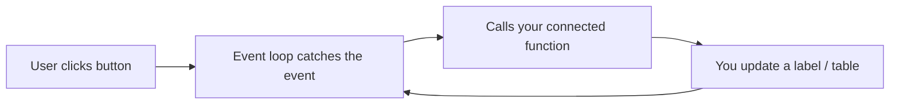

# M14 GUI Development (PySide6)


**Topics covered:** what Qt is · `QApplication` & the event loop · two ways to build a window · `QMainWindow` vs `QWidget` · layouts · signals & slots · common widgets · stylesheets (QSS) · Qt Designer · building a data dashboard

## The Why?

Every program you have built so far runs in a terminal.
That is fine for you — but hand one of those scripts to a friend, a manager, or a shop owner, and the first question is always the same: *"Why do I have to type commands? Where are the buttons?"*

A **Graphical User Interface (GUI)** — a window with buttons, text boxes, tables and charts — is how non-programmers expect software to behave. The moment your expense tracker (M12) or AI rewriter (M16) grows a window, it stops being "a script" and becomes "a tool" someone can actually use.

This module teaches you to build those windows with **PySide6**.

---

## Core Concepts

### What Is Qt (and PySide6)?

**Qt** (pronounced *"cute"*) is a large, mature C++ framework used to build desktop software. The apps you already use prove it works: VLC, OBS Studio, Telegram Desktop and Anaconda Navigator are all built with Qt.

Qt is actually *many* toolkits in one — it has parts for networking, databases, multimedia and more. **In this course we only use one part: the GUI toolkit** (the module called `QtWidgets`). Everything else you can safely ignore for now.

**PySide6** is the official Python binding for Qt 6 — it lets you call Qt's GUI tools from Python instead of C++.

```bash
pip install PySide6
```

> 💡 You may also see **PyQt6** in tutorials. It is a different binding for the *same* Qt library, so the code looks almost identical. We use PySide6 because it is the official one and is free for any use.

---

### Every PySide App Has the Same Shape

No matter how big the app, three things always happen:

```python
import sys
from PySide6.QtWidgets import QApplication, QLabel

app = QApplication(sys.argv)          # 1. Create the one application object
label = QLabel("Hello, GUI world!")   # 2. Create something to show
label.show()                          # 3. Make it visible

sys.exit(app.exec())                  # 4. Hand control to Qt's event loop
```

`app.exec()` starts the **event loop** — an infinite loop that waits for things to happen (a click, a keypress, the window closing) and reacts to them. Your program "lives" inside this loop until the user closes the window. `sys.exit(...)` then ends the process cleanly.



---

### Two Ways to Build a Window

There are two common styles for writing a PySide app. Both produce the same window — they differ in how the code is organised.

**Style 1 — Script style (quick & flat).** Create widgets one after another at the top level. Great for a tiny throwaway tool, but it gets messy fast as the app grows.

```python
import sys
from PySide6.QtWidgets import QApplication, QWidget, QVBoxLayout, QPushButton

app = QApplication(sys.argv)
window = QWidget()                    # a blank window
window.setWindowTitle("Quick Tool")

layout = QVBoxLayout(window)
layout.addWidget(QPushButton("Click me"))

window.show()
sys.exit(app.exec())
```

**Style 2 — Class style (the real-app way).** Put the window in your own class that *subclasses* a Qt window. State lives on `self`, so any method can reach any widget. **This is how every non-trivial app is built**, and the style we use in the Guided Practice.

```python
import sys
from PySide6.QtWidgets import QApplication, QMainWindow, QPushButton

class MyApp(QMainWindow):
    def __init__(self):
        super().__init__()
        self.setWindowTitle("Real App")
        button = QPushButton("Click me")
        button.clicked.connect(self.on_click)   # method as the handler
        self.setCentralWidget(button)

    def on_click(self):
        print("Button clicked!")

app = QApplication(sys.argv)
window = MyApp()
window.show()
sys.exit(app.exec())
```

#### `QWidget` vs `QMainWindow` — which base class?

| Base class | Use it for |
|------------|-----------|
| `QWidget` | A plain, blank window. Perfect for small single-screen tools. |
| `QMainWindow` | A full application window — it adds slots for a **menu bar**, **toolbar**, **status bar**, and a **central widget**. Use it for anything that looks like a "real" app. |

With `QMainWindow` you set the main content with `self.setCentralWidget(some_widget)`.

---

### Layouts — Arranging Widgets

**Never** place widgets at fixed pixel coordinates — the result breaks the moment the window is resized. Instead, hand your widgets to a **layout manager** that positions them for you.

| Layout | Behavior |
|--------|----------|
| `QVBoxLayout` | Stack widgets vertically (top → bottom) |
| `QHBoxLayout` | Arrange widgets horizontally (left → right) |
| `QFormLayout` | Two columns: a label on the left, a field on the right |
| `QGridLayout` | A 2-D grid — you give each widget a row and column |

The same set of widgets — a **title** and **four buttons** — lands in a completely different arrangement depending on which layout you hand it to. The script below builds all three side by side so you can compare them at a glance (each box gets its own widgets, because a widget can live in only one layout):

```python
import sys
from PySide6.QtWidgets import (
    QApplication, QWidget, QGroupBox, QLabel, QPushButton,
    QVBoxLayout, QHBoxLayout, QGridLayout,
)


def make_widgets():
    title = QLabel("Menu")
    buttons = [QPushButton(f"Button {i}") for i in range(1, 5)]
    return title, buttons


def vbox_group():                       # title on top, buttons in a vertical column
    box = QGroupBox("QVBoxLayout")
    title, buttons = make_widgets()
    layout = QVBoxLayout()
    layout.addWidget(title)
    for button in buttons:
        layout.addWidget(button)
    box.setLayout(layout)
    return box


def hbox_group():                       # title, then all four buttons, in one row
    box = QGroupBox("QHBoxLayout")
    title, buttons = make_widgets()
    layout = QHBoxLayout()
    layout.addWidget(title)
    for button in buttons:
        layout.addWidget(button)
    box.setLayout(layout)
    return box


def grid_group():                       # title spans the top, buttons fill a 2x2 grid
    box = QGroupBox("QGridLayout")
    title, buttons = make_widgets()
    layout = QGridLayout()
    layout.addWidget(title, 0, 0, 1, 2)  # row 0, col 0, span 1 row x 2 cols
    layout.addWidget(buttons[0], 1, 0)   # row 1, col 0
    layout.addWidget(buttons[1], 1, 1)   # row 1, col 1
    layout.addWidget(buttons[2], 2, 0)   # row 2, col 0
    layout.addWidget(buttons[3], 2, 1)   # row 2, col 1
    box.setLayout(layout)
    return box


app = QApplication(sys.argv)
window = QWidget()
window.setWindowTitle("Qt Layouts — VBox / HBox / Grid")

root = QHBoxLayout(window)               # hold the three demo boxes side by side
root.addWidget(vbox_group())
root.addWidget(hbox_group())
root.addWidget(grid_group())

window.show()
sys.exit(app.exec())
```

Layouts **nest freely**: a horizontal row of buttons (`QHBoxLayout`) can sit inside a vertical column of panels (`QVBoxLayout`). That nesting is how every complex screen is built.

---

### Signals and Slots — How Widgets Talk to Your Code

This is the heart of Qt. When something happens to a widget, it **emits a signal**. You connect that signal to a **slot** — any Python function — and Qt calls it for you.

```
widget.signal.connect(your_function)
```

```python
def on_submit():
    name = name_input.text()
    result_label.setText(f"Hello, {name}!")

submit_button.clicked.connect(on_submit)   # connect the signal to the slot
```

Common signals you will use constantly:

| Signal | Fires when… |
|--------|-------------|
| `QPushButton.clicked` | the button is pressed |
| `QLineEdit.textChanged` | the text changes (every keystroke) |
| `QLineEdit.returnPressed` | the user presses Enter in the field |
| `QComboBox.currentTextChanged` | a different drop-down item is chosen |

---

### Common UI Widgets

A **widget** is any visible element. These are the ones you will reach for most:

| Widget | Purpose | Read its value with |
|--------|---------|---------------------|
| `QLabel` | Read-only text or image (titles, results, status) | — |
| `QPushButton` | A clickable button | — |
| `QLineEdit` | Single-line text input | `.text()` |
| `QTextEdit` | Multi-line text input | `.toPlainText()` |
| `QSpinBox` | Whole-number input with ↑↓ arrows | `.value()` |
| `QComboBox` | Drop-down list, pick one | `.currentText()` |
| `QCheckBox` | A toggle (yes / no) | `.isChecked()` |
| `QTableWidget` | A grid of rows and columns | per-cell |

The script below puts one of each in a window and wires a **Read values** button that pulls the current value out of every widget and shows it in a label — run it to see how each `.text()` / `.value()` / `.isChecked()` call works:

```python
import sys
from PySide6.QtWidgets import (
    QApplication, QWidget, QFormLayout, QLabel, QPushButton,
    QLineEdit, QTextEdit, QSpinBox, QComboBox, QCheckBox,
)

app = QApplication(sys.argv)
window = QWidget()
window.setWindowTitle("Common Widgets")

name_input = QLineEdit()
name_input.setPlaceholderText("Enter your name")

note_input = QTextEdit()
note_input.setPlaceholderText("A longer note…")

qty_input = QSpinBox()
qty_input.setRange(1, 99)

product_combo = QComboBox()
product_combo.addItems(["Coffee Beans", "Paper Cups", "Lids"])

agree_check = QCheckBox("I agree")

result = QLabel("Fill the form, then click Read values.")
read_button = QPushButton("Read values")


def read_values():
    result.setText(
        f"name={name_input.text()!r}, "
        f"note={note_input.toPlainText()!r}, "
        f"qty={qty_input.value()}, "
        f"product={product_combo.currentText()!r}, "
        f"agree={agree_check.isChecked()}"
    )


read_button.clicked.connect(read_values)

form = QFormLayout(window)
form.addRow("Name:", name_input)
form.addRow("Note:", note_input)
form.addRow("Quantity:", qty_input)
form.addRow("Product:", product_combo)
form.addRow("", agree_check)
form.addRow(read_button)
form.addRow(result)

window.show()
sys.exit(app.exec())
```

---

### `QMessageBox` — Pop-up Dialogs

Use a message box to confirm an action or report an error without writing your own window:

The script below gives each kind of message box its own button so you can pop them on demand. The `question` box returns which button the user clicked, so you can branch on the answer:

```python
import sys
from PySide6.QtWidgets import (
    QApplication, QWidget, QVBoxLayout, QLabel, QPushButton, QMessageBox,
)

app = QApplication(sys.argv)
window = QWidget()
window.setWindowTitle("QMessageBox demo")

status = QLabel("Click a button to open a message box.")
info_button = QPushButton("Show info")
warn_button = QPushButton("Show warning")
ask_button = QPushButton("Ask a question")


def show_info():
    QMessageBox.information(window, "Saved", "Your changes were saved.")
    status.setText("Showed an information box.")


def show_warning():
    QMessageBox.warning(window, "Invalid Input", "Please enter a number.")
    status.setText("Showed a warning box.")


def ask_question():
    reply = QMessageBox.question(window, "Confirm", "Delete this row?")
    if reply == QMessageBox.StandardButton.Yes:
        status.setText("User clicked Yes — would delete the row.")
    else:
        status.setText("User clicked No — nothing deleted.")


info_button.clicked.connect(show_info)
warn_button.clicked.connect(show_warning)
ask_button.clicked.connect(ask_question)

layout = QVBoxLayout(window)
layout.addWidget(info_button)
layout.addWidget(warn_button)
layout.addWidget(ask_button)
layout.addWidget(status)

window.show()
sys.exit(app.exec())
```

---

### Making It Look Modern — Stylesheets (QSS)

Default Qt widgets look plain. To get the rounded cards, accent colours and clean spacing of a modern app, you style widgets with **Qt Style Sheets (QSS)** — a dialect that looks almost exactly like CSS.

```python
window.setStyleSheet("""
    QPushButton {
        background-color: #6366f1;
        color: white;
        border-radius: 8px;
        padding: 8px 16px;
    }
    QPushButton:hover { background-color: #4f46e5; }
""")
```

Give a widget an identity with `widget.setObjectName("card")`, then target it with `#card { ... }` — exactly like a CSS `#id`. The Guided Practice uses this to build a clean dashboard look.

---

### Qt Designer — Drawing UIs Instead of Coding Them

For large interfaces, typing every widget by hand is slow. **Qt Designer** is a free drag-and-drop tool: you place widgets visually, and it saves a `.ui` (XML) file that PySide6 loads at runtime via `QUiLoader`.

> Designing layouts visually is a deep topic and **not a focus of this course** — we build our UIs in code so every line is explicit and easy to learn from. Just know Qt Designer exists; it ships with the `pyside6-tools` package (`pyside6-designer`) and is worth exploring once the concepts here feel comfortable.

---

## Going Further

<details>
<summary><code>QTimer</code> — Non-Blocking Timers</summary>

Never use `time.sleep()` in a GUI — it freezes the whole window. Use `QTimer` instead:

```python
from PySide6.QtCore import QTimer

timer = QTimer()
timer.timeout.connect(update_clock)   # called on every tick
timer.start(1000)                     # tick every 1000 ms
```

</details>

<details>
<summary><code>QThread</code> — Background Work Without Freezing</summary>

Long jobs (an API call, an Ollama request, reading a big file) block the event loop and freeze the UI. Run them in a `QThread` so the window stays responsive — this is the right way to call the AI model from M16 inside a GUI.

</details>

<details>
<summary>Connecting a GUI to SQLite (M12)</summary>

The two-step pattern behind every database-backed button: write, then refresh the display.

```python
def save_record(self):
    self.conn.execute("INSERT INTO products (name) VALUES (?)", (name,))
    self.conn.commit()
    self.refresh_table()      # reload the view so the user sees the change
```

</details>

<details>
<summary>Charts with <code>QtCharts</code> (and drawing your own with <code>QPainter</code>)</summary>

The Guided Practice uses **QtCharts** — pick a *series*, drop it in a `QChart`, show it in a `QChartView`:

```python
from PySide6.QtCharts import QChart, QChartView, QPieSeries

series = QPieSeries()
series.setHoleSize(0.5)              # a hole turns the pie into a donut
series.append("Beverages", 1720)
series.append("Bakery", 855)

chart = QChart(); chart.addSeries(series)
view = QChartView(chart)            # a normal widget — add it to any layout
```

QtCharts also has `QLineSeries`, `QBarSeries`, `QScatterSeries` and more, all with built-in axes, legends and tooltips.

If you ever need *total* control (a custom gauge, a bespoke diagram), you can still paint a widget by hand: subclass `QWidget`, override `paintEvent`, and use `QPainter` (`drawPie`, `drawPolyline`, …), calling `self.update()` to repaint. That is the low-level path QtCharts saves you from.

</details>

<details>
<summary>Shipping a <code>.exe</code> with PyInstaller</summary>

Turn your app into a single double-clickable file so non-programmers can run it without installing Python:

```bash
pip install pyinstaller
pyinstaller --onefile --windowed stock_dashboard_example.py
```

</details>

---

## Guided Practice

**Scenario:** A small cafe-shop owner wants a two-page tool. **Page 1 (Overview)** answers *what sold this month by category, how daily sales moved, and which products made money* — with KPI cards, a **donut chart**, a **line chart** and a **cost & profit table**. **Page 2 (Records)** shows a sample of the in/out log.

To keep the focus on the GUI, **all numbers come from one fixed `shop_data.json` file**. We build in four phases, in the order a real app comes together — and you **run the file after every step**, so the window grows in front of you one panel at a time:

1. **Phase A — The data** (Step 1): a fixed JSON file and the one function that loads it.
2. **Phase B — Display blocks** (Steps 2-5): a window with just a title first, then KPI cards, then charts, then tables — each added and run before the next.
3. **Phase C — Wire the buttons** (Step 6): the **Add movement** button that opens a form window.
4. **Phase D — Make it look good** (Step 7): the dark QSS stylesheet and palette, applied last.

The finished app (`stock_dashboard_example.py`) uses nothing beyond PySide6 — the charts come from the built-in **QtCharts** module, written in the **class style** with `QMainWindow`. Create **one** empty `stock_dashboard_example.py` and type into it as you go; by the last step you will have written the whole program yourself, never copied a finished file or skipped a line.

---

## Phase A — The data (one fixed JSON file)

### Step 1 — Load the sample data

The data file `shop_data.json` is already provided for you in this module folder. It holds the already-totalled numbers each panel needs: four KPIs, four category slices for the donut, one value per day for the line chart, ten product rows for the cost/profit table, and twelve movement rows for the Records page. Open it and skim its shape so you know what each panel reads:

One small function reads it. Put the imports and this at the top of `stock_dashboard_example.py`:

```python
import json, os, sys


def load_data():
    path = os.path.join(os.path.dirname(os.path.abspath(__file__)), "shop_data.json")
    with open(path, encoding="utf-8") as f:
        return json.load(f)
```

That is the entire data layer. Everything else is GUI.

---

## Phase B — Build the display blocks

Now the GUI. The two charts come from **QtCharts** — a ready-made Qt module, so we draw nothing by hand. Add these imports below the others at the top of the file:

```python
from PySide6.QtCharts import (
    QAreaSeries, QChart, QChartView, QLineSeries, QPieSeries, QValueAxis,
)
from PySide6.QtCore import QDate, Qt
from PySide6.QtGui import QColor, QPainter, QPalette, QPen
from PySide6.QtWidgets import (
    QApplication, QComboBox, QDateEdit, QDialog, QDialogButtonBox, QFormLayout,
    QFrame, QHBoxLayout, QHeaderView, QLabel, QMainWindow, QPushButton,
    QSpinBox, QStackedWidget, QTableWidget, QTableWidgetItem, QVBoxLayout, QWidget,
)
```

> QtCharts ships with PySide6 — no extra install needed.

Next, paste this block of colour constants right below the imports. The panels reference these names as we build them (the KPI accents, chart colours and table colours all live here); the full stylesheet in Step 7 reuses the very same names, so there is one place to change a colour later:

```python
BG_APP = "#1e1f22"
BG_SIDEBAR = "#181a1d"
BG_CARD = "#2b2d31"
BG_ELEV = "#313338"
BORDER = "#3f4147"
TEXT = "#f2f3f5"
TEXT_MUTED = "#b5bac1"
TEXT_DIM = "#80848e"
ACCENT = "#5865f2"
GREEN = "#23a55a"
RED = "#f23f43"
```

From here on you add one method (or a couple) per step, **run the file after each step, and watch a new panel appear in the window.** Nothing is hidden — by the end of Phase D you will have typed every line of `stock_dashboard_example.py` yourself.

### Step 2 — A blank window with a page title

Get a window on screen before adding panels. `Dashboard` subclasses `QMainWindow` and keeps the loaded `data` on `self` so every build method can read it. For now `_build_ui` shows the **Overview** page on its own — we will wrap it in a sidebar and a second page in Step 5. Add a temporary `main()` so you can run it immediately:

```python
class Dashboard(QMainWindow):
    def __init__(self, data):
        super().__init__()
        self.data = data
        self._charts = []                      # keeps chart objects alive (see Step 4)
        self.setWindowTitle("ShopBoard — Monthly Analytics")
        self.resize(1040, 720)
        self._build_ui()

    def _build_ui(self):
        # Temporary: show the Overview page on its own.
        # Replaced with a sidebar + stacked pages in Step 5.
        self.setCentralWidget(self._build_overview_page())

    def _build_overview_page(self):
        page = QWidget()
        layout = QVBoxLayout(page)
        layout.setContentsMargins(24, 20, 24, 20)
        layout.setSpacing(16)

        title = QLabel("Overview")
        title.setObjectName("pageTitle")
        subtitle = QLabel(f"Sales & inventory · {self.data['month']}")
        subtitle.setObjectName("pageSubtitle")
        layout.addWidget(title)
        layout.addWidget(subtitle)
        # KPIs, charts and the table get appended to this layout in Steps 3-5.
        return page


def main():                                    # temporary; finished in Step 7
    app = QApplication(sys.argv)
    window = Dashboard(load_data())
    window.show()
    sys.exit(app.exec())


if __name__ == "__main__":
    main()
```

**Run it now** — `python stock_dashboard_example.py`. A grey 1040×720 window opens with the heading **Overview** and the month subtitle. Plain, but it runs. Every following step appends to this same Overview page.

### Step 3 — KPI cards

The four headline numbers, read straight from `self.data["kpis"]` and written into the labels as the cards are built — there is no separate refresh step. Add both methods to the `Dashboard` class:

```python
    def _build_kpis(self):
        row = QHBoxLayout()
        row.setSpacing(14)
        kpis = self.data["kpis"]
        self._add_kpi(row, "Revenue", f"${kpis['revenue']:,.0f}", ACCENT)
        self._add_kpi(row, "Profit", f"${kpis['profit']:,.0f}", GREEN)
        self._add_kpi(row, "Units Sold", f"{kpis['units']:,}", TEXT)
        self._add_kpi(row, "Margin", f"{kpis['margin']:.1f}%", "#f0b232")
        return row

    def _add_kpi(self, row, title, value_text, accent):
        card = QFrame()
        card.setObjectName("card")
        box = QVBoxLayout(card)
        box.setContentsMargins(18, 14, 18, 14)
        box.setSpacing(4)
        caption = QLabel(title)
        caption.setObjectName("kpiTitle")
        value = QLabel(value_text)
        value.setObjectName("kpiValue")
        value.setStyleSheet(f"color: {accent};")
        box.addWidget(caption)
        box.addWidget(value)
        row.addWidget(card)
```

Then wire it into the page by adding **one line** to `_build_overview_page`, right after the subtitle is added:

```python
        layout.addLayout(self._build_kpis())
```

**Run it now.** The four KPI cards appear in a row under the title — Revenue, Profit, Units Sold and Margin, each value coloured. They look plain (no card backgrounds yet); the styling lands in Step 7.

### Step 4 — The two charts (with QtCharts)

QtCharts gives you ready-made chart pieces, so there is no `paintEvent` to write. The recipe is always the same three steps: pick a **series** (the data), drop it in a **`QChart`**, and show that chart in a **`QChartView`** (a normal widget you can add to any layout).

* **Donut** — a `QPieSeries`; `setHoleSize(0.5)` turns the pie into a donut.
* **Line** — a `QLineSeries` wrapped in a `QAreaSeries` for the filled look, with its own `QValueAxis` on the bottom and left.

We build one helper method per chart (they read `self.data`), plus two shared helpers — `_chart_card` wraps any view in the same card frame, and `_chart_view` is where we keep the chart object alive. Add all five methods to the class:

```python
    def _build_charts(self):
        row = QHBoxLayout()
        row.setSpacing(14)
        row.addWidget(self._chart_card("Sales by Category", self._donut_view()), stretch=1)
        row.addWidget(self._chart_card("Daily Units Sold", self._line_view()), stretch=1)
        return row

    def _chart_card(self, title, view):
        """Wrap a QChartView in the same dark #card frame as everything else."""
        card = QFrame()
        card.setObjectName("card")
        box = QVBoxLayout(card)
        box.setContentsMargins(18, 14, 18, 14)
        label = QLabel(title)
        label.setObjectName("cardTitle")
        box.addWidget(label)
        box.addWidget(view)
        return card

    def _donut_view(self):
        """A donut = a QPieSeries with a hole punched in the middle."""
        series = QPieSeries()
        series.setHoleSize(0.5)
        for c in self.data["categories"]:
            slice_ = series.append(f"{c['category']}  ({c['units']})", c["units"])
            slice_.setColor(QColor(c["color"]))
        chart = QChart()
        chart.addSeries(series)
        chart.legend().setAlignment(Qt.AlignRight)
        self._style_chart(chart)
        return self._chart_view(chart)

    def _line_view(self):
        """A filled line chart: a QLineSeries wrapped in a QAreaSeries."""
        line = QLineSeries()
        for day, units in self.data["daily"]:
            line.append(day, units)

        self._charts.append(line)   # QAreaSeries won't keep its line series alive

        area = QAreaSeries(line)
        area.setColor(QColor(88, 101, 242, 130))      # translucent fill
        area.setPen(QPen(QColor(ACCENT), 2))          # solid top line

        chart = QChart()
        chart.addSeries(area)
        chart.legend().hide()

        axis_x = QValueAxis()
        axis_x.setLabelFormat("%d")
        axis_x.setTickCount(7)
        axis_y = QValueAxis()
        axis_y.setLabelFormat("%d")
        chart.addAxis(axis_x, Qt.AlignBottom)
        chart.addAxis(axis_y, Qt.AlignLeft)
        area.attachAxis(axis_x)
        area.attachAxis(axis_y)
        for axis in (axis_x, axis_y):
            axis.setLabelsColor(QColor(TEXT_DIM))
            axis.setGridLineColor(QColor(BORDER))
            axis.setLinePenColor(QColor(BORDER))

        self._style_chart(chart)
        return self._chart_view(chart)

    def _style_chart(self, chart):
        """Make a chart blend into its dark #card frame."""
        chart.setBackgroundVisible(False)             # show the card behind it
        chart.legend().setLabelColor(QColor(TEXT_MUTED))

    def _chart_view(self, chart):
        self._charts.append(chart)   # hold a Python ref so the chart isn't GC'd
        view = QChartView(chart)
        view.setRenderHint(QPainter.Antialiasing)
        view.setMinimumHeight(240)
        return view
```

> ⚠️ **Keep your chart objects alive.** In PySide6 a `QChartView` does **not** hold a Python reference to its `QChart`, and a `QAreaSeries` does not hold one to its line series. If they are only local variables, Python garbage-collects them the moment the method returns and the app **crashes with an access violation** (`0xC0000005`) when it tries to paint freed C++ objects. That is exactly why `_chart_view` does `self._charts.append(chart)` and `_line_view` also appends its `line` — stashing a Python reference on `self` keeps the C++ objects alive.

Now add **one line** to `_build_overview_page`, right after the KPI line from Step 3:

```python
        layout.addLayout(self._build_charts(), stretch=1)
```

**Run it now.** Below the KPI cards, two charts appear side by side: a **donut** of sales by category (with a legend on the right) and a **filled line chart** of daily units across the month. The data is real — it comes straight from `shop_data.json`.

### Step 5 — The cost/profit table, then the two-page layout

Two things happen in this step. First, the cost & profit table at the bottom of the Overview page. Then we wrap everything in a sidebar plus a second page.

**5a — The cost & profit table.** It fills a `QTableWidget` row by row from `self.data["products"]`, colouring the profit column. Add this method to the class:

```python
    def _build_table_card(self):
        card = QFrame()
        card.setObjectName("card")
        box = QVBoxLayout(card)
        box.setContentsMargins(18, 14, 18, 16)
        title = QLabel("Cost & Profit by Product")
        title.setObjectName("cardTitle")
        box.addWidget(title)

        headers = ["Product", "Category", "In Qty", "In Cost", "Sold", "Revenue", "Profit"]
        products = self.data["products"]
        table = QTableWidget(len(products), len(headers))
        table.setHorizontalHeaderLabels(headers)
        table.verticalHeader().setVisible(False)
        table.setEditTriggers(QTableWidget.NoEditTriggers)
        table.setSelectionBehavior(QTableWidget.SelectRows)
        table.setAlternatingRowColors(True)
        table.horizontalHeader().setSectionResizeMode(QHeaderView.Stretch)

        for r, row in enumerate(products):
            cells = [
                (row["name"], Qt.AlignLeft),
                (row["category"], Qt.AlignLeft),
                (f"{row['in_qty']:,}", Qt.AlignRight),
                (f"${row['in_cost']:,.0f}", Qt.AlignRight),
                (f"{row['out_qty']:,}", Qt.AlignRight),
                (f"${row['revenue']:,.0f}", Qt.AlignRight),
                (f"${row['profit']:,.0f}", Qt.AlignRight),
            ]
            for c, (text, align) in enumerate(cells):
                item = QTableWidgetItem(text)
                item.setTextAlignment(align | Qt.AlignVCenter)
                if c == 6:  # colour the profit column
                    item.setForeground(QColor(GREEN if row["profit"] >= 0 else RED))
                table.setItem(r, c, item)

        box.addWidget(table)
        return card
```

Add **one line** to `_build_overview_page`, right after the charts line:

```python
        layout.addWidget(self._build_table_card(), stretch=1)
```

**Run it now.** The full Overview page is done: title, four KPIs, two charts, and a ten-row cost/profit table with green/red profit numbers.

**5b — The Records page.** A second page that fills a `QTableWidget` straight from `self.data["records"]`, colouring the type and total columns. Add this method:

```python
    def _build_records_page(self):
        page = QWidget()
        layout = QVBoxLayout(page)
        layout.setContentsMargins(24, 20, 24, 20)
        layout.setSpacing(16)

        title = QLabel("Records")
        title.setObjectName("pageTitle")
        subtitle = QLabel("A sample of stock-in and stock-out movements")
        subtitle.setObjectName("pageSubtitle")
        layout.addWidget(title)
        layout.addWidget(subtitle)

        card = QFrame()
        card.setObjectName("card")
        box = QVBoxLayout(card)
        box.setContentsMargins(18, 14, 18, 16)
        headers = ["Date", "Product", "Category", "Type", "Qty", "Unit Value", "Total Value"]
        table = QTableWidget(len(self.data["records"]), len(headers))
        table.setHorizontalHeaderLabels(headers)
        table.verticalHeader().setVisible(False)
        table.setEditTriggers(QTableWidget.NoEditTriggers)
        table.setSelectionBehavior(QTableWidget.SelectRows)
        table.setAlternatingRowColors(True)
        table.horizontalHeader().setSectionResizeMode(QHeaderView.Stretch)

        for r, rec in enumerate(self.data["records"]):
            is_out = rec["kind"] == "out"
            type_text = "OUT · sale" if is_out else "IN · restock"
            type_color = GREEN if is_out else "#f0883e"
            cells = [
                (rec["date"], Qt.AlignLeft, None),
                (rec["name"], Qt.AlignLeft, None),
                (rec["category"], Qt.AlignLeft, None),
                (type_text, Qt.AlignLeft, type_color),
                (f"{rec['qty']:,}", Qt.AlignRight, None),
                (f"${rec['unit']:,.0f}", Qt.AlignRight, None),
                (f"${rec['total']:,.0f}", Qt.AlignRight, GREEN if is_out else RED),
            ]
            for c, (text, align, color) in enumerate(cells):
                item = QTableWidgetItem(text)
                item.setTextAlignment(align | Qt.AlignVCenter)
                if color:
                    item.setForeground(QColor(color))
                table.setItem(r, c, item)

        box.addWidget(table)
        layout.addWidget(card, stretch=1)
        return page
```

**5c — The sidebar and the two-page layout.** The sidebar holds the two nav buttons (`checkable` + `autoExclusive` so exactly one stays highlighted) and the **Add movement** button. The nav buttons flip a `QStackedWidget` — a widget that holds several pages but shows only one. Add both methods:

```python
    def _build_sidebar(self):
        bar = QFrame()
        bar.setObjectName("sidebar")
        bar.setFixedWidth(210)
        layout = QVBoxLayout(bar)
        layout.setContentsMargins(16, 20, 16, 16)
        layout.setSpacing(6)

        logo = QLabel("◆  ShopBoard")
        logo.setObjectName("logo")
        layout.addWidget(logo)
        layout.addSpacing(12)

        self.nav_overview = self._nav_button("Overview")
        self.nav_records = self._nav_button("Records")
        self.nav_overview.setChecked(True)
        self.nav_overview.clicked.connect(lambda: self.stack.setCurrentIndex(0))
        self.nav_records.clicked.connect(lambda: self.stack.setCurrentIndex(1))
        layout.addWidget(self.nav_overview)
        layout.addWidget(self.nav_records)

        layout.addStretch()

        add_btn = QPushButton("+  Add movement")
        add_btn.setObjectName("primary")
        add_btn.clicked.connect(self.add_movement)
        layout.addWidget(add_btn)

        footer = QLabel("JSON · PySide6")
        footer.setObjectName("footer")
        layout.addWidget(footer)
        return bar

    def _nav_button(self, text):
        btn = QPushButton(text)
        btn.setObjectName("nav")
        btn.setCheckable(True)
        btn.setAutoExclusive(True)   # only one nav item highlighted at a time
        return btn
```

The sidebar's **Add movement** button connects to `self.add_movement`, so that method has to exist before the sidebar is built. Add a short version now — it opens a dialog we write in Step 6:

```python
    def add_movement(self):
        """Open the entry form. This demo only *shows* the window."""
        product_names = [p["name"] for p in self.data["products"]]
        MovementDialog(product_names, self).exec()
```

Finally, **replace** the temporary `_build_ui` from Step 2 with the real one — a horizontal row of *sidebar | stacked pages*:

```python
    def _build_ui(self):
        root = QWidget()
        self.setCentralWidget(root)
        row = QHBoxLayout(root)
        row.setContentsMargins(0, 0, 0, 0)
        row.setSpacing(0)
        row.addWidget(self._build_sidebar())

        # Two pages live in a QStackedWidget; the sidebar switches between them.
        self.stack = QStackedWidget()
        self.stack.addWidget(self._build_overview_page())   # index 0
        self.stack.addWidget(self._build_records_page())    # index 1
        row.addWidget(self.stack, stretch=1)
```

**Run it now.** The app has its final shape: a left sidebar with **Overview** / **Records** buttons that switch pages, and the **+ Add movement** button at the bottom. Click between the two pages and watch the content swap. *(Don't click Add movement yet — its dialog arrives in Step 6.)*

---

## Phase C — Wire the buttons

### Step 6 — The Add-movement form

The nav buttons already work (you wired them in Step 5). The last button, **Add movement**, calls `self.add_movement`, which opens a form window — but the `MovementDialog` class it refers to does not exist yet. Let's write it.

For this beginner build the form is **display only** — it shows what an entry screen looks like; clicking **Save** just closes it. (Actually storing the row is a Checkpoint below.) The dialog is a `QComboBox` (product), a kind combo (in / out), a `QSpinBox` (quantity) and a `QDateEdit`, with a `QDialogButtonBox` for the standard **Save / Cancel** pair.

Add this class at the **top level** of the file (not inside `Dashboard` — put it just above the `Dashboard` class). Python looks up the name only when the button is clicked, so its position relative to `Dashboard` does not matter:

```python
class MovementDialog(QDialog):
    """A small form that *shows* what an add-movement screen looks like.

    This is a UI demo: the Save button just closes the window. Wiring it to
    really store a row is left as a Checkpoint.
    """

    def __init__(self, product_names, parent=None):
        super().__init__(parent)
        self.setWindowTitle("Add Movement")
        self.setMinimumWidth(320)

        form = QFormLayout(self)
        form.setContentsMargins(20, 20, 20, 16)
        form.setSpacing(12)

        self.product = QComboBox()
        self.product.addItems(product_names)

        self.kind = QComboBox()
        self.kind.addItem("Stock-in  (purchase)", "in")
        self.kind.addItem("Stock-out (sale)", "out")

        self.qty = QSpinBox()
        self.qty.setRange(1, 9999)
        self.qty.setValue(10)

        self.when = QDateEdit()
        self.when.setCalendarPopup(True)
        self.when.setDisplayFormat("yyyy-MM-dd")
        self.when.setDate(QDate(2026, 6, 15))

        form.addRow("Product:", self.product)
        form.addRow("Type:", self.kind)
        form.addRow("Quantity:", self.qty)
        form.addRow("Date:", self.when)

        buttons = QDialogButtonBox(QDialogButtonBox.Save | QDialogButtonBox.Cancel)
        buttons.accepted.connect(self.accept)     # Save just closes the window
        buttons.rejected.connect(self.reject)
        form.addRow(buttons)
```

**Run it now.** Click **+ Add movement** in the sidebar. A form window opens with the product drop-down, type, quantity and date fields, plus **Save** / **Cancel**. Save and Cancel both just close it — that is all this demo needs.

The whole app **works now** — it just looks plain and grey. That is exactly the right moment to add style.

---

## Phase D — Make it look good (styling last)

### Step 7 — The dark stylesheet, palette, and launch

Function first, paint second. Everything works; now we make it look like a real app. There are three pieces of styling, all using the colour constants from the top of the file.

**7a — The main-window stylesheet.** A single QSS block (CSS-like rules) targeting the `objectName`s we set along the way: `#sidebar`, `#card`, `#nav`, `#primary`, and so on. Add it at the **top level** of the file (below the `Dashboard` class is fine — it is just a module-level string). It is an f-string so the `{BG_APP}`-style names get filled in from the constants; note every literal CSS brace is doubled (`{{` / `}}`) so Python does not read it as a placeholder:

```python
STYLE = f"""
* {{ font-family: 'Segoe UI', 'Microsoft JhengHei', sans-serif; }}
QMainWindow, QWidget {{ background-color: {BG_APP}; color: {TEXT}; }}
/* Labels must be transparent — otherwise they paint the dark window colour
   and every title shows up sitting on a black strip inside its card. */
QLabel {{ background-color: transparent; }}

#sidebar {{ background-color: {BG_SIDEBAR}; border-right: 1px solid {BORDER}; }}
#logo {{ font-size: 16px; font-weight: 700; color: {TEXT}; }}
QPushButton#nav {{
    background-color: transparent; border: none; text-align: left;
    color: {TEXT_MUTED}; padding: 9px 10px; border-radius: 8px; font-weight: 600;
}}
QPushButton#nav:hover {{ background-color: {BG_CARD}; color: {TEXT}; }}
QPushButton#nav:checked {{ background-color: {BG_ELEV}; color: {TEXT}; }}
#footer {{ color: {TEXT_DIM}; font-size: 11px; }}

#pageTitle {{ font-size: 22px; font-weight: 700; }}
#pageSubtitle {{ color: {TEXT_MUTED}; font-size: 12px; }}

#card {{ background-color: {BG_CARD}; border: 1px solid {BORDER}; border-radius: 12px; }}
#cardTitle {{ font-size: 14px; font-weight: 700; color: {TEXT}; }}
#kpiTitle {{ font-size: 12px; color: {TEXT_DIM}; }}
#kpiValue {{ font-size: 24px; font-weight: 700; }}

QPushButton {{
    background-color: {BG_ELEV}; color: {TEXT}; border: 1px solid {BORDER};
    border-radius: 8px; padding: 8px 12px; font-weight: 600;
}}
QPushButton:hover {{ background-color: #3a3c42; }}
QPushButton#primary {{ background-color: {ACCENT}; border: none; color: white; }}
QPushButton#primary:hover {{ background-color: #4752c4; }}

QComboBox {{
    background-color: {BG_ELEV}; color: {TEXT}; border: 1px solid {BORDER};
    border-radius: 8px; padding: 6px 10px; min-width: 130px;
}}
QComboBox:hover {{ border-color: {ACCENT}; }}
QComboBox QAbstractItemView {{
    background-color: {BG_ELEV}; color: {TEXT};
    selection-background-color: {ACCENT}; outline: none;
}}

QTableWidget {{
    background-color: {BG_CARD}; alternate-background-color: {BG_ELEV};
    border: none; gridline-color: transparent; color: {TEXT};
}}
QTableWidget::item {{ padding: 6px; border: none; }}
QTableWidget::item:selected {{ background-color: rgba(88,101,242,0.30); }}
QHeaderView::section {{
    background-color: {BG_CARD}; color: {TEXT_DIM}; padding: 8px;
    border: none; border-bottom: 1px solid {BORDER}; font-weight: 600;
}}
QScrollBar:vertical {{ background: {BG_CARD}; width: 10px; margin: 0; }}
QScrollBar::handle:vertical {{ background: {BORDER}; border-radius: 5px; min-height: 24px; }}
QScrollBar::add-line, QScrollBar::sub-line {{ height: 0; }}
"""
```

**7b — The dialog stylesheet and palette.** A smaller sheet for the pop-up form, plus a `QPalette` so even native widgets (the calendar pop-up, scroll bars) follow the dark theme. Add both at the top level:

```python
DIALOG_STYLE = f"""
QDialog {{ background-color: {BG_APP}; }}
QLabel {{ background: transparent; color: {TEXT_MUTED}; }}
QComboBox, QSpinBox, QDateEdit {{
    background-color: {BG_ELEV}; color: {TEXT};
    border: 1px solid {BORDER}; border-radius: 8px; padding: 6px 8px;
}}
QComboBox:hover, QSpinBox:hover, QDateEdit:hover {{ border-color: {ACCENT}; }}
QComboBox QAbstractItemView {{
    background-color: {BG_ELEV}; color: {TEXT};
    selection-background-color: {ACCENT};
}}
QPushButton {{
    background-color: {ACCENT}; color: white; border: none;
    border-radius: 8px; padding: 7px 16px; font-weight: 600;
}}
QPushButton:hover {{ background-color: #4752c4; }}
"""


def apply_dark_palette(app):
    """Make native dialogs match the dark theme too."""
    palette = QPalette()
    palette.setColor(QPalette.Window, QColor(BG_APP))
    palette.setColor(QPalette.WindowText, QColor(TEXT))
    palette.setColor(QPalette.Base, QColor(BG_CARD))
    palette.setColor(QPalette.AlternateBase, QColor(BG_ELEV))
    palette.setColor(QPalette.Text, QColor(TEXT))
    palette.setColor(QPalette.Button, QColor(BG_ELEV))
    palette.setColor(QPalette.ButtonText, QColor(TEXT))
    palette.setColor(QPalette.Highlight, QColor(ACCENT))
    palette.setColor(QPalette.HighlightedText, QColor("white"))
    app.setPalette(palette)
```

**7c — Switch the styling on.** Three small edits apply the sheets you just wrote:

1. At the **end of `_build_ui`**, add the line that styles the whole window:

```python
        self.setStyleSheet(STYLE)
```

2. At the **end of `MovementDialog.__init__`** (from Step 6), add the line that styles the dialog:

```python
        self.setStyleSheet(DIALOG_STYLE)
```

3. **Replace** the temporary `main()` from Step 2 with the finished one, which sets the Fusion style and applies the dark palette before the window is shown:

```python
def main():
    data = load_data()

    app = QApplication(sys.argv)
    app.setStyle("Fusion")     # consistent dark rendering on every OS
    apply_dark_palette(app)

    window = Dashboard(data)
    window.show()
    sys.exit(app.exec())
```

**Run it one last time** — `python stock_dashboard_example.py`. The plain grey shell is now a dark, rounded-card dashboard. Switch between **Overview** and **Records** in the sidebar, and click **Add movement** to pop the (now dark) entry form. **This is the moment a pile of numbers becomes software a shop owner would actually open every morning.**

> You have now typed the complete `stock_dashboard_example.py` — every line, in order. The file in this folder is the same program; use it only to compare against yours if something does not line up.

---

## Checkpoints

* [ ] **Add a "Top Day" KPI**
  Add a fifth KPI card showing the single best sales day of the month and its unit count (e.g. `"Day 28 · 180"`). *(Hint: `self.data["daily"]` is a list of `[day, units]` — take `max(..., key=lambda d: d[1])`.)*

* [ ] **Make the Add-movement form actually work**
  Right now `MovementDialog` only displays. Add a `values()` method that returns the chosen `(date, product, kind, qty)`, and in `add_movement` check `if dialog.exec() == QDialog.Accepted:` — then append a new row to the Records table. *(Hint: a `QMessageBox.information` confirming "Saved" is a nice touch.)*

* [ ] **Filter the Records page**
  Add a `QComboBox` of product names above the records table. On `currentTextChanged`, rebuild the table showing only rows whose `name` matches (or all, for an "All products" option). One signal, one slot — no database needed, just filter the `self.data["records"]` list in Python.

* [ ] **AI Email Polisher (Desktop App)**
  Wrap the polite-email rewriter from M16 in a real window: a `QTextEdit` for the draft, a **Polish** button, and a read-only `QTextEdit` for the result. Disable the button while the model runs. *(Hint: run the Ollama call in a `QThread` so the window does not freeze — see Going Further.)*
