# Python Zero to One

> **From absolute beginner to building modern, efficient Python applications — amplified by AI.**

This course takes you from knowing nothing about code (**Zero**) to building your first Python application (**One**).
You will learn how to use AI to generate rapid prototypes, then refine those outputs into reliable code by understanding the syntax and logic behind them.

**Total estimated time: ~28 hours across 16 modules.**

---

## Getting Started

Before beginning, set up the following environment.

### Step 1 — Prepare an AI Assistant

AI assistants can explain unfamiliar syntax, generate examples, and help debug errors while you learn.
We recommend **[Gemini](https://gemini.google.com/)** (free, no install required).
If you hit a problem at any point, ask Gemini first.

### Step 2 — Install Python

Python is the language this entire course runs on.
Download and install **[Python 3.12+](https://www.python.org/downloads/)**.

During installation, **check the box that says "Add Python to PATH".**

Verify it works by opening a terminal and running:
```bash
python --version
```

### Step 3 — Install an IDE

A dedicated code editor makes writing, running, and debugging Python dramatically faster.
We recommend **[JetBrains PyCharm Community Edition](https://www.jetbrains.com/pycharm/)** (free).
[Visual Studio Code](https://code.visualstudio.com/) with the Python extension is also excellent.

### Step 4 — Clone this repository

Install **[Git](https://git-scm.com/)**, then open a terminal and run:
```bash
git clone https://github.com/kevinju0827/Python-Zero-to-One.git
```

Open the cloned folder in your IDE.
When new modules are released, pull the latest changes with `git pull`.

> **macOS users:** Install [Homebrew](https://brew.sh/) first, then `brew install git`.

### Step 5 — Open a module README

Each module folder contains a `README.md` with all learning materials.
Open it in your IDE and switch to **Preview** mode to see it rendered.

---

## Course Philosophy

**AI is a first-draft generator, not a final authority.**

In the AI era, you no longer need to hand-code every line. However, AI works with limited context—it cannot fully understand your project's business logic or edge cases. It hallucinates, makes off-by-one errors, and confidently produces broken code.

**To use AI effectively, you need enough Python literacy to review and fix what it produces.**

That is the core skill this course builds: not the ability to write everything from scratch, but the ability to *read*, *understand*, *modify*, and *guide* AI-generated code. A well-crafted follow-up prompt is often more valuable than typing code yourself.

---

## Curriculum

```mermaid
graph LR
    subgraph "Foundation (M01–M09)"
        M01["M01\nPython Basic"] --> M02["M02\nVariables & Types"]
        M02 --> M03["M03\nConditional Logic"]
        M03 --> M04["M04\nData Structures"]
        M04 --> M05["M05\nIteration"]
        M05 --> M06["M06\nFunctions"]
        M06 --> M07["M07\nOOP"]
        M07 --> M08["M08\nError Handling"]
        M08 --> M09["M09\nModules & File I/O"]
    end
    subgraph "Data & Web (M10–M13)"
        M09 --> M10["M10\nData Formats"]
        M10 --> M11["M11\nWeb Requests"]
        M11 --> M12["M12\nDatabase"]
        M12 --> M13["M13\nWeb API"]
    end
    subgraph "Applications (M14–M16)"
        M13 --> M14["M14\nGUI"]
        M14 --> M15["M15\nScheduling"]
        M15 --> M16["M16\nLocal AI"]
    end
```



| # | Module | Topics | Time |
|---|--------|--------|------|
| M01 | **[Python Basic](M01PythonBasic/README.md)** | Interactive mode · `print()` · math operators · scripts · vibe coding | ~1 hr |
| M02 | **[Variables & Types](M02Variables/README.md)** | Variables · `str` / `int` / `float` / `bool` · type conversion · f-strings · `input()` | ~1 hr |
| M03 | **[Conditional Logic](M03ConditionalLogic/README.md)** | Comparison operators · `if` / `elif` / `else` · logical operators · Boolean expressions | ~1 hr |
| M04 | **[Data Structures](M04DataStructures/README.md)** | `list` · `tuple` · `dict` · `set` · indexing · slicing · common methods | ~1.5 hr |
| M05 | **[Iteration](M05Iteration/README.md)** | `for` loop · `while` loop · `range()` · `enumerate()` · `break` / `continue` | ~1.5 hr |
| M06 | **[Functions](M06Function/README.md)** | `def` · parameters · return values · default args · scope · DRY principle | ~1.5 hr |
| M07 | **[OOP](M07OOP/README.md)** | Classes · `__init__` · methods · `self` · inheritance · `super()` · `__str__` | ~1.5 hr |
| M08 | **[Error Handling](M08ErrorHandling/README.md)** | Exceptions · `try` / `except` / `finally` · specific error types · defensive code | ~1 hr |
| M09 | **[Modules & File I/O](M09Packages/README.md)** | `import` · stdlib (`os`, `datetime`, `math`, `random`) · `pip` · `venv` · `open()` · read/write files | ~1.5 hr |
| M10 | **[Data Formats](M10DataFormat/README.md)** | CSV (`csv` module) · JSON (`json` module) · file-to-Python type conversion | ~1.5 hr |
| M11 | **[Web Requests](M11Requests/README.md)** | HTTP protocol · `requests` library · REST APIs · GET / POST / PATCH / DELETE · error handling | ~2 hr |
| M12 | **[Database](M12Database/README.md)** | SQLite · `sqlite3` · SQL CRUD · parameterized queries · `commit()` · `WHERE` / `ORDER BY` | ~2 hr |
| M13 | **[Web API](M13FastAPI/README.md)** | FastAPI · Uvicorn · routes · path/query params · Pydantic · status codes · Swagger UI | ~2 hr |
| M14 | **[GUI Development](M14PySide/README.md)** | PySide6 · widgets · layouts · signals & slots · `QMessageBox` | ~2 hr |
| M15 | **[Scheduling](M15Schedule/README.md)** | `time.sleep()` · `schedule` library · long-running scripts · graceful shutdown | ~1.5 hr |
| M16 | **[Local AI (Ollama)](M16Ollama/README.md)** | LLMs locally · Ollama API · prompt engineering · streaming · defensive calls | ~1.5 hr |

---

## How Each Module Is Structured

Every module contains the same five sections, so you always know where to look:

1. **The Why?** — Real-world motivation. Why does this exist, and what problem does it solve?
2. **Core Concepts** — The technical content: syntax, pseudocode examples, analogies, and diagrams.
3. **Going Further** *(collapsible)* — Optional deep dives: advanced patterns, AI usage tips, performance notes. Skip freely.
4. **Guided Practice** — A step-by-step walkthrough of a realistic mini-project using that module's skills.
5. **Checkpoints** — Independent exercises for you to complete on your own. Proof that you understood the material.

> **On checkpoints:** There is no single correct answer. Since we embrace AI-assisted development, "done" means you can *explain* your logic, *handle errors*, and *modify* your code with confidence — not just that the AI produced output.

---

## Tech Stack

### Core Language

- **[Python 3.12+](https://www.python.org/)** — The only language used throughout this course.

### Development Tools

| Tool | Purpose |
|------|---------|
| [PyCharm Community](https://www.jetbrains.com/pycharm/) | Recommended IDE — Python-specific, built-in debugger |
| [VS Code](https://code.visualstudio.com/) + Python extension | Lightweight alternative IDE |
| [Gemini](https://gemini.google.com/) | AI assistant for explaining concepts and generating code |
| [JetBrains AI](https://www.jetbrains.com/ai-ides/) | In-IDE AI for PyCharm users |

### Third-Party Libraries (installed per module)

| Library | Module | Purpose |
|---------|--------|---------|
| `requests` | M11 | HTTP requests to web APIs |
| `beautifulsoup4` | M11 | HTML parsing / web scraping |
| `fastapi`, `uvicorn` | M13 | Building REST APIs |
| `PySide6` | M14 | Desktop GUI applications |
| `schedule` | M15 | Human-readable task scheduling |
| `ollama` / local API | M16 | Running LLMs locally via Ollama |
| `pyautogui` | M17 | Mouse and keyboard automation |

### Practice APIs & Datasets

| Resource | Used In | What It Provides |
|----------|---------|-----------------|
| [JSONPlaceholder](https://jsonplaceholder.typicode.com/) | M11 | Fake REST API — free CRUD practice |
| [Frankfurter](https://www.frankfurter.app/) | M11 | Live currency exchange rates, no key needed |
| [Books to Scrape](https://books.toscrape.com/) | M11 | Safe HTML scraping practice target |
| [Taiwan Open Data](https://data.gov.tw/) | M11 | Real government datasets |
| [Kaggle Datasets](https://www.kaggle.com/datasets) | M10, M12 | Community CSV / JSON datasets |

---

## Recommended Resources

These are not required, but they will accelerate your learning:

- **[Official Python Docs](https://docs.python.org/3/)** — The authoritative reference. Dense but accurate.
- **[Real Python](https://realpython.com/)** — In-depth, practical tutorials for all skill levels.
- **[roadmap.sh/python](https://roadmap.sh/python)** — Visual map of the Python learning landscape.
- **[Atguigu Python (Chinese)](https://youtu.be/n97hSmVyjsg?list=PLmOn9nNkQxJFWhyrhPNkpI3lMuKxBTxBe)** — Comprehensive free video series in Mandarin.
- **[LeetCode](https://leetcode.com/)** — Coding challenge platform; great for sharpening algorithmic thinking.

---

## License

Distributed under the MIT License. See `LICENSE` for more information.
